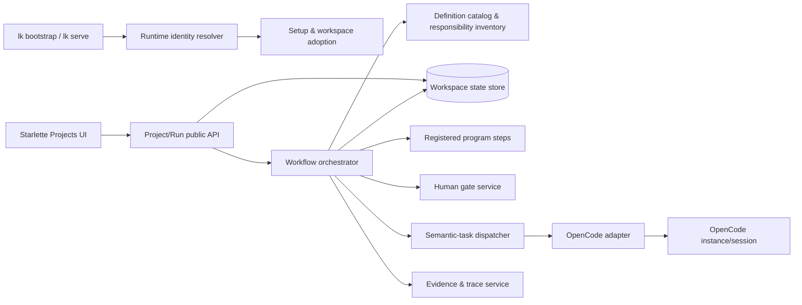
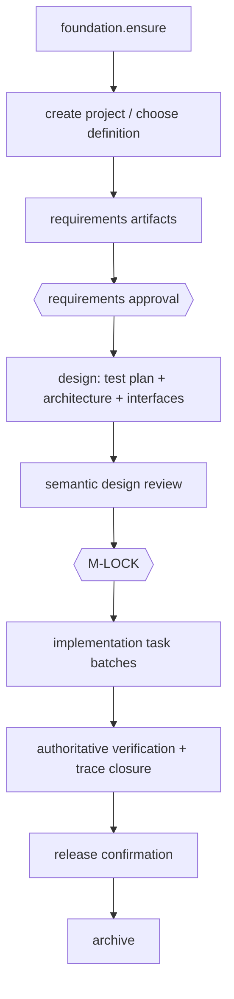

# Programmatic Workflow Control — Architecture

> **Codex** [RESOLVED]: M-ARCH 已完成并由 Archer/Prism 校验通过。请确认 architecture.md、interfaces.md、test-plan.md 共同构成的设计合同可以进入 M-LOCK；批准后只锁定合同，不会开始业务实现。
>> **Aaron**: 已评审，现在请锁定。但不要开始业务实现

## 1. 目标、边界与架构原则

本设计把 workflow 的状态、合法转移、批准与证据闭环从 Maestro 移入程序。Maestro/其他 Agent 只能完成被派发的语义任务，或在受限 decision node 中提交建议；它们不能写入 run 状态、越过 gate、执行任意 shell，或自行选择未注册步骤。

本轮交付的是完整的 v0.12 产品闭环：初始化、项目创建、两种 workflow、两次人类 gate、设计/开发/验证、历史归档、OpenCode session、项目级 runtime 安装与迁移。浏览器兼容性矩阵不属于本轮范围；产品 E2E 只要求一个受支持的浏览器路径。

架构不改变现有 Python/Starlette Web 基础，也不删除 legacy `maestro.py`、Scout 或 Warden；它们在 v0.12 新 run 中不再是调度权威或 foundation stage。旧 workspace 只经显式采用后保留为 legacy 历史。

## 2. 核心决定与取舍

| 决定                                                                | 解决的问题                                     | 代价与主要风险                                              | 对应要求                                |
| ------------------------------------------------------------------- | ---------------------------------------------- | ----------------------------------------------------------- | --------------------------------------- |
| 以 versioned catalog 描述 workflow，Runtime 独占状态写入            | 固定步骤、拒绝跳步、使历史可解释               | 要维护 definition 迁移；初期不支持任意用户脚本              | FR-0001—FR-0301、FR-1701、NFR-0001/0101 |
| 用 workspace 内 SQLite（Python stdlib）保存 run、gate、事件和证据   | 原子提交、重启恢复、并发 CAS，且不引入服务依赖 | 单机写并发有限；跨机器协作以后需迁移存储后端                | FR-0101/0201、FR-0601、NFR-0001/0101    |
| Foundation、readiness、artifact digest、trace 检查均为注册程序步骤  | 剥离 Scout/Warden 这类工具包装 Agent，保证幂等 | 规则会逐步增长，必须由责任 inventory 约束                   | FR-0301/0401、FR-1601                   |
| 把 requirements approval 和 M-LOCK 建成不同的不可 waive gate        | 先批准需求才能设计，再批准设计才能开发         | 增加流程等待时间；必须有清楚的 UI 和拒绝返回路径            | FR-0501、FR-0801/0901                   |
| OpenCode 由可替换 adapter 管理，session/context manifest 持久化     | detach/attach/恢复和真实/替身一致的审计        | 外部 OpenCode API 失败或版本漂移，需要兼容性探针与 L3 smoke | FR-1401/1501、NFR-0201                  |
| 每个 workspace 固定 runtime identity，local 为默认、global 必须显式 | A x.y 与 B x.z 并存且不静默降级                | 需维护安装 artifact 的哈希和 schema 兼容规则                | FR-2401、FR-2301                        |
| UI 只调用 public project/run API，页面不推导合法状态                | Web 可操作而不复制流程规则                     | API contract 必须完整，旧 `web/app.py` 要分层迁移           | FR-1001—FR-1301、FR-1801—FR-2001        |

## 3. 总体结构与调用方向

调用只能由左至右：UI/CLI 不直接写状态库；adapter 不转移 workflow；semantic task 只返回契约化 result；program step 不能绕过 orchestrator 的事务；store 不解释业务规则。legacy Maestro 可作为 `semantic-task` 的受控咨询 provider，但没有 Store 写权限。

## 模块划分

| 模块（建议路径）                        | 职责                                                                                                 | 禁止承担的职责                          | 主要需求                             |
| --------------------------------------- | ---------------------------------------------------------------------------------------------------- | --------------------------------------- | ------------------------------------ |
| `louke/runtime/identity.py`             | 向上发现最近 workspace、读取/验证 runtime lock、选择 local/global、以固定 identity 启动 server/child | 不能在 local 异常时自动 global fallback | FR-2401                              |
| `louke/runtime/setup.py`                | init/adopt 向导、first-user、readiness、legacy preview/apply/rollback                                | 不能从旧 `current_stage` 猜造新 run     | FR-0701、FR-1801、FR-2301            |
| `louke/runtime/catalog.py`              | definition schema、版本、静态验证、built-in responsibility inventory、一致性校验                     | 不能执行 shell 或保存 run               | FR-0001、FR-1601/1701                |
| `louke/runtime/domain.py`               | 不可变 command/result/value schema 与错误分类                                                        | 不访问 HTTP、文件或数据库               | FR-0101、NFR-0201                    |
| `louke/runtime/store.py`                | SQLite transaction、revision CAS、event append、读模型与恢复                                         | 不决定下一步骤                          | FR-0101/0201、FR-0601、NFR-0001/0101 |
| `louke/runtime/orchestrator.py`         | 只一处合法转移：校验 command、调用步骤、原子写状态/事件/证据指针                                     | 不内嵌 Agent prompt，不让调用者传 stage | FR-0101、FR-0501、FR-1701            |
| `louke/runtime/program_steps/`          | `foundation.ensure`、readiness、文档/digest/trace 校验、发布/归档检查、资源清理                      | 不作产品语义判断或向模型询问            | FR-0301/0401、FR-2201                |
| `louke/runtime/gates.py`                | requirements approval、review result、M-LOCK challenge、绑定 principal/hash/reason                   | 不接受无认证主体或 stale digest         | FR-0501、FR-0801/0901                |
| `louke/runtime/semantic.py`             | 从 catalog 生成任务 manifest、派发、验证结构化返回、限制可选分支                                     | 不直接转移 run 或执行程序副作用         | FR-1501—FR-1701                      |
| `louke/opencode/`                       | real HTTP adapter、contract adapter、instance/session lifecycle、attach/detach/cancel                | 不保存 workflow truth                   | FR-1401、NFR-0201                    |
| `louke/runtime/projects.py`             | project/backlog/archive 生命周期和项目视图组合                                                       | 不重复 workflow graph 规则              | FR-1001—FR-1301、FR-1901/2001        |
| `louke/runtime/evidence.py`             | artifact 版本/digest、FR/AC-task-code-test trace、evidence freshness                                 | 不把 Agent 自报当通过证据               | FR-0601、FR-2201                     |
| `louke/web/projects.py` 与模板/静态资产 | Projects sidebar、创建表单、graph、gate、bindings、session/detail 页面                               | 不存储 secret 或推导下一状态            | FR-1001—FR-1501、FR-1901             |

## 4. 数据、事务与恢复

状态库为 `.louke/runtime/state.sqlite3`，由 workspace runtime 管理；human secret、token、OpenCode credential 只引用 OS keychain/受控环境变量，不写入该库或 API 响应。建议的持久对象如下：

| 对象                                                | 不可变/可变边界                                 | 关键不变量                                                 |
| --------------------------------------------------- | ----------------------------------------------- | ---------------------------------------------------------- |
| `workflow_definitions` / `responsibility_inventory` | definition version 与 inventory revision 不可变 | run 绑定的版本不可替换；所有 built-in 都分类且注册一致     |
| `projects` / `workflow_runs`                        | run 的 status/revision 受事务更新               | 一项目可有历史 run；active run 的合法动作由 catalog 决定   |
| `step_attempts` / `semantic_tasks`                  | 每次尝试追加，结果不可篡改                      | 一个 dispatch 有固定 model/context/permission snapshot     |
| `gates` / `artifacts`                               | digest 对应 artifact revision；批准记录追加     | gate 只匹配同一 run、同一 gate kind、同一 digest           |
| `workflow_events`                                   | append-only                                     | 每个状态或证据变化有 actor、时间、correlation id、revision |
| `agent_sessions`                                    | lifecycle 更新并保留关联                        | detach 不删除；end/cancel 有终态和清理记录                 |
| `trace_items` / `trace_links`                       | evidence revision 追加                          | FR/AC 只有映射、代码证据、权威测试均 fresh 才可完成        |
| `workspace_runtime` / `migration_records`           | runtime identity 与 adopt 记录版本化            | local/global 决定可复现；legacy 不伪装为恢复 run           |

每个 external command 都带 `expected_revision` 或 idempotency key。orchestrator 在一个 SQLite transaction 内：读取 revision → 验证合法 action/gate/digest → 写 step attempt、run revision、事件与证据引用。冲突返回明确 `revision_conflict`，不重试并吞掉他人动作。崩溃后用最后提交事务恢复；未完成外部调用以 attempt 的 correlation id 查询/补偿，永不假定成功。

## 5. Workflow catalog 与动态边界

catalog 至少提供固定版本的 `new_feature` 和 `bug_fix` definition。每个 node 为 `program`、`human_gate`、`semantic_task` 或 `decision`；没有任意 shell node。

`bug_fix` 先运行 `source_contract.verify`：仅在 source spec/AC 和既有 requirements approval 均可验证时，继承批准而不创建 requirements gate。随后 decision node 只接受 catalog 枚举的 `quick_rgr` 或 `design_required` 建议；runtime 对建议的 schema、证据和允许候选校验后选择。两个分支都进入当前 run 的 M-LOCK，之后才可实现。条件不充分或建议冲突时，状态为 `waiting_for_clarification`，人类选择允许的 action；Maestro 没有直接写状态能力。

这张总图不省略 definition 中的强制节点。`new_feature` 的实际 catalog 必须依次显式包含 requirements author/review、requirements approval、test-plan author/review、architecture/interfaces author/review、M-LOCK、可追溯 implementation batch、code review 与权威 unit/integration、E2E、按 policy 适用的 security/release、human milestone close、archive。`bug_fix` 的 quick path 显式包含 GitHub Issue/source-contract 校验、失败复现、M-LOCK、R-G-R、code review/权威回归、policy release confirmation、archive；design-required path 在 M-LOCK 前加入三份设计文档及 review。实际走过、因 definition/policy 不适用而跳过的节点与分支都留在 graph/event 中。

责任 inventory 是版本化、可审查的 catalog 附属物，覆盖所有 built-in definition、agent prompt/tool contract、registered handler：`program`、`semantic`、`mixed` 三类。`mixed` 项必须列出程序副作用与语义输入/输出两个边界；catalog build 和 task dispatch 均拒绝缺项或分类不一致的 inventory。

## 6. Gate、artifact 与完成证据

requirements gate 固定绑定 `story.md`、`spec.md`、`acceptance.md` 的 digest、review threads 和自动校验结果；只有认证 human principal 批准精确 digest 才进入设计。设计阶段产出 `test-plan.md`、`architecture.md`、`interfaces.md`；完成 review 后，M-LOCK 绑定这三份设计文档**以及已批准需求三件套**的共同 contract digest、审查结论和静态检查。两种 gate 均不可 force-skip/waive；拒绝必须给理由并走 definition 声明的返回路径。

开发按 task batch 派发。每个 batch 映射 FR/AC、GitHub issue（若适用）及允许的 repository scope；完成时收集 commit/diff、测试 run、覆盖结果和审查结果。`completion.verify` 只接受权威测试和 fresh trace，缺少 mapping、证据、失败测试或 stale artifact 时不能发布/归档。

## 7. OpenCode 与上下文设计

真实 adapter 通过受版本探针保护的 HTTP/SDK contract 创建 instance/session，支持 `create`、`send`、`detach`、`attach`、`cancel`、`end`、`status`、`messages`。session id、owner task、runtime identity、lifecycle event 和 redacted context manifest 被持久化；server 重启后 attach 同一 session 或报告明确不可恢复原因。

每个 semantic task 在 dispatch 时由程序生成不可变 Context Manifest：run/step/task id、definition/runtime version、被分配 FR/AC/issue、artifact digest 和最小读取集、允许 tools/写路径/副作用、model binding snapshot、输出 schema、redaction policy。Agent 只收到该 manifest 与引用的内容；其结构化产物再由程序验证。用户在 binding 图拖拽的修改创建新的 override revision，只影响之后创建的任务，绝不改写在途 task。

## 8. 项目级 runtime 与启动

稳定 bootstrap `lk` 先从 cwd 向上发现最近 `.louke/project`。它读取项目所有的 runtime lock（mode、package version/build、artifact hash、schema compatibility、install root），验证后 exec 固定的 local runtime；global mode 必须是显式 lock 选择且也先通过 compatibility check。local artifact 缺失、损坏、hash/version/schema 不匹配时 fail closed，显示 repair 操作，绝不静默回退 global。只接受 Louke 受验证 artifact，不执行任意仓库脚本。

初次 `lk init`/adopt 由 bootstrap 运行：写最小 project metadata，安装或确认目标 local runtime，随后以该 runtime controlled restart。server 派发的每个 child process 继承同一 resolved runtime identity（而不是环境 PATH 中的 `lk`）。安装/upgrade/repair 作用域是当前 workspace lock；A x.y、B x.z 可同时运行，项目 C 仅在 explicit global mode 下使用全局 runtime。

## 9. 安全与可操作性

Web server 只绑定 loopback，首次 setup 创建本地 human principal；写操作必须有同源会话、CSRF 防护与 actor audit。密码只保存经现代 password hash 处理的验证物；API/事件/manifest 默认 redact secret、token、Authorization、私钥及敏感 prompt 字段。Projects UI 展示 current step、停止原因、下一合法 action、artifact/gate digest、事件、session 和 trace；取消须确认，停止调度并清理受管资源，历史变为只读。

## 10. 需求落点与非功能约束

| 需求              | 架构落点                                                                            |
| ----------------- | ----------------------------------------------------------------------------------- |
| FR-0001—FR-0701   | catalog、orchestrator、store、program steps、legacy isolation                       |
| FR-0801—FR-0901   | gates、artifact digest/review、definition stage rules                               |
| FR-1001—FR-1301   | projects service、Projects UI、run-scoped model override                            |
| FR-1401—FR-1501   | OpenCode adapter/session store、Context Manifest                                    |
| FR-1601—FR-1701   | responsibility inventory、semantic dispatcher、finite decision nodes                |
| FR-1801—FR-2001   | setup/readiness、detail view、recovery/cancel/archive                               |
| FR-2101—FR-2201   | full `new_feature`/`bug_fix` catalog、source-contract verifier、trace/evidence gate |
| FR-2301           | adoption preview/migration records/legacy read model                                |
| FR-2401           | bootstrap resolver、project runtime lock、verified local artifact                   |
| NFR-0001—NFR-0101 | SQLite transaction/CAS/event append/recovery protocol                               |
| NFR-0201          | adapter contract, deterministic contract adapter, L3 real smoke                     |
| NFR-0301          | test plan product journeys and a single supported-browser UI route                  |
| NFR-0401          | loopback-only server, authenticated principal, redaction and credential boundaries  |

## 11. 实施顺序与兼容策略

实现按可运行纵切面推进：① workspace/runtime resolver、catalog/store/orchestrator 与 foundation；② setup/projects/gates/read views；③ OpenCode/context/semantic dispatch 与 bindings；④ complete new-feature/bug-fix、trace/recovery/archive；⑤ legacy adopt、local install/upgrade/repair；⑥ product E2E 与 security hardening。每一切面先增加 public contract tests，再接 UI；在 M-LOCK 前不得开始这些实现。

新 runtime 只读取自己管理的 state store。v0.10/v0.11 的 document/wiki/历史数据经 preview 选择性复制或引用为 legacy；原始资料不被重写，未知 `current_stage` 只显示为 legacy 状态。旧 `lk` 入口继续可用以服务未采用 workspace；采用完成后由 runtime lock 决定 v0.12 行为。
