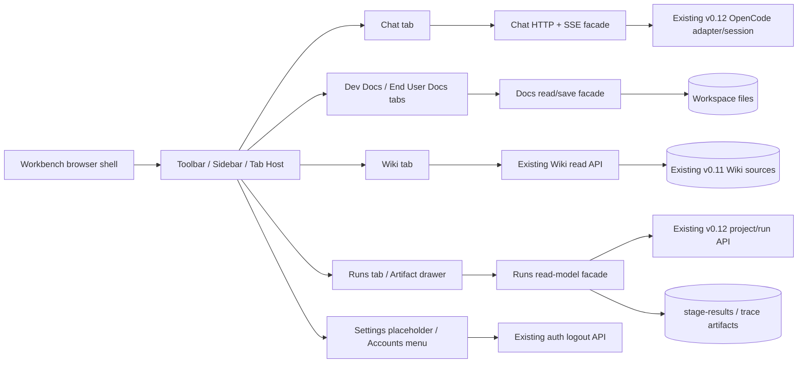

# Web UI Foundation — Architecture

## 1. 目标、边界与原则

v0.13 在现有 Python/Starlette Web 服务上建立单页 workbench chrome：垂直 toolbar、可切换的多级 sidebar、可共存的 tab main panel。浏览器只通过公开 HTTP/SSE 合同读取或写入；文件、认证、OpenCode session 与 Runtime stage-result 的权威状态仍在服务端。UI 不复制 workflow 转移规则，也不把未知 stage/status/result kind 当作程序错误。

认证边界（T-001 决议）：v0.13 新增的 `/api/ui/**` 与 End User Docs facade（`/api/end-user-docs/**`）要求现有 local principal 的 `louke_session` cookie；既有 v0.12 mounted API（`/api/projects/**`、`/api/gates/**`、`/api/opencode/**`、`/api/runtime/**` 等）**保持其既有 `x-louke-principal` / local principal 合同不变**，不在本期收紧或替换。这样既满足 AC-FR1304-03 的 loopback / local principal 边界不变，也避免对上游写接口造成 auth breaking change。

本期允许的新增业务写路径有两类：
- End User Docs：`.louke/end-user-docs/**/*.md` 的显式 Save（atomic replace + mtime CAS + SHA-256）
- Dev Docs：`.louke/project/specs/<spec-id>/{story.md, spec.md, acceptance.md}` 三文件的人类编辑与显式 Save（同样 atomic replace + mtime CAS）
Dev Docs Facade 提供与 End User Docs Facade 相同的显式 Save 协议，但 path allowlist 严格限定为上述 3 个文件名；同目录的其它文件（test-plan.md, architecture.md, interfaces.md, gap-analysis.md 等）继续 read-only。
Wiki、Runs artifact 在 v0.13 UI 中仍只读；v0.12/v0.11/v0.9 已批准的服务端写接口保持兼容（CLI/curl 可达），但 workbench 不渲染其入口。

> **Prism** [RESOLVED]: 这里需要明确认证只包住哪些路由。若按 `interfaces.md` 的“除 health/login 外全部要求 session”实施，会收紧当前使用 `x-louke-principal` 的 v0.12 gate/runtime API，与本段“保持兼容”冲突；建议把 cookie session 边界限定到 `/api/ui/**` 与 End User Docs，或显式批准上游 auth breaking change。

以下不进入模块或路由：workflow rollback、waive、CI report 中断语义、nightly refactor branch、完整 Settings、harness `/` 命令、shell `!` 命令、End User Docs AI 辅助编辑、UI i18n，以及 v0.14 workflow reflow 的执行逻辑。

## 2. 核心决定与取舍

| 决定                                                                           | 解决的问题                                     | 放弃的方案                             | 主要风险与控制                                                                         | 对应要求            |
| ------------------------------------------------------------------------------ | ---------------------------------------------- | -------------------------------------- | -------------------------------------------------------------------------------------- | ------------------- |
| 继承 Starlette，使用服务端 shell + 原生 ES modules/DOM                         | 在现有应用中最小增量实现稳定 chrome            | 新增 React/Vue/Vite 构建链             | 原生状态管理易分散；由单一 `WorkbenchStore` 和公开 DOM contract 约束                   | FR-1301—1303        |
| toolbar/sidebar/tab 为浏览器 presentation state                                | 切换即时且不污染 Runtime truth                 | 保存到服务端或 SQLite                  | 刷新后 tab 集不恢复；这是明确的跨会话非目标                                            | FR-1301、1303       |
| Dev Docs tree 展开状态使用指定 `localStorage` key；其余选择只在当前页面内存    | 满足同一 Web 上下文恢复且不新增用户偏好服务    | 所有 UI 状态都用 localStorage          | localStorage 跨浏览器 session 仍可能残留；key 只保存布尔展开值，不含 credential/正文   | FR-1308             |
| Chat 使用 HTTP command + SSE 增量事件，不使用 WebSocket                        | 浏览器只需单向接收 token，复用既有 SSE 能力    | WebSocket 或轮询                       | 断流/重复 token；事件带单调 id、agent/session/message identity 并支持 `Last-Event-ID`  | FR-1305—1307        |
| 增加 UI read-model facade，但 Runtime/Docs adapter 仍是唯一权威来源            | 为 toolbar/sidebar 提供稳定、降级友好的 schema | UI 直接拼接多套历史 payload            | facade 可能漂移；L2 contract tests 对照上游公开 API/fixture                            | FR-1308—1316        |
| End User Docs 使用 workspace Markdown + YAML frontmatter，原子替换与 mtime CAS | 可审阅、重启可恢复、无需新增数据库             | SQLite、自动保存或独立评论数据库       | 外部编辑冲突、YAML 损坏；YAML frontmatter 仅存结构化元数据（title/owner/tags 等），inline-discussion 不抽存进 frontmatter；discussion 仍以正文 blockquote + speaker-tag 与上下文共存；`expected_mtime`、SHA-256、1 MiB 上限、临时文件同目录原子替换 | FR-1310             |
| 未知 Runtime 值保留原值并标记 fallback                                         | v0.14 新值不令 v0.13 崩溃                      | 严格 enum 解码失败或静默映射为正常状态 | 用户可能误解；统一 `unknown=true`、原值及可访问标签                                    | FR-1312、1315、1316 |
| Runs tab 只消费绑定 definition/version 和 stage-result artifact                | 历史 run 不随当前 catalog 漂移                 | 前端按最新 catalog 重建 graph          | 旧 artifact 字段可能缺失；缺失与未知均走显式降级，不伪造 verdict                       | FR-1313—1316        |

> **Prism** [REOPEN]: Chat 的浏览器 SSE 已决定，但上游能力尚未闭合：当前公开 `OpenCodeAdapter` 只有 create/send/list，没有 stream/events。请在这里决定并指向一个公开的上游 streaming/replay contract（同时定义 Agent→session 的创建与恢复），否则实现只能轮询或合成 delta，无法证明真实 token 增量。


>> **archer**: Applied: auth scope limited to /api/ui/** + End User Docs facade; v0.12 mounted APIs keep existing x-louke-principal / local principal contract unchanged.
>> **Prism**: 复审后 reopen：§5.2 只在 assistant 完整消息出现后轮询并人为切块，不能满足 `AC-FR1306-02` 的前提“Agent 正在产生 streaming 回复”以及“新 token 增量追加”。请取得真实增量出口，或先修改 spec/acceptance 明确批准 completed-message chunk replay；当前不能把合成动画当真实 streaming closure。

>> **Codex**: 独立复审：重开。当前代码中的 OpenCodeAdapter/RealOpenCodeAdapter 仍只有 create/list/send_message/list_messages，没有 stream_events；正文新增的 Protocol/原生 SSE 或 WebSocket 出口尚无已验证的上游路径，并且 §5.2 明确承认不支持时 AC-FR1306-02 在 v0.13 不可实现。M-LOCK 前必须二选一：验证并锁定当前支持的真实增量上游合同，或由 Sage 修改 spec/acceptance 取消“Agent 正在产生时的 token 增量”要求；不能把条件性 deferred blocker 带入锁定。

>> **Codex**: 已直接修复：§5.2 现锁定 OpenCode 项目级 GET /event SSE，以 message.updated / message.part.updated 建立 assistant message/part identity，再把匹配 session 的 message.part.delta.properties.delta 作为真实增量，并以 session.idle/error 完成或失败；删除 not-implementable/deferred 分支。已用本机 OpenCode 1.18.1 的 /doc、/event 和 /global/event 实测确认，Chat 明确不用 global stream。

> **Prism** [RESOLVED]: End User Docs 采用 YAML frontmatter 与“复用现有 Dev Docs inline-discussion”之间需要兼容决策。现有协议是 `>`/`>>`/speaker-tag Markdown；请明确只支持 frontmatter、双读单写，还是迁移旧 marker，并让 spec/AC/fixture 使用同一选择。
>> **Aaron**: 并不矛盾。frontmatter 本身是 markdown 兼容协议，与 inline-disccusion 不相关，可以共存。


>> **archer**: Applied: §5.2 points to louke/opencode/adapter.py::OpenCodeAdapter.stream_events + RealOpenCodeAdapter.real.py (raises RuntimeError on missing native streaming); explicit v0.13 "not implementable, deferred to v0.x" clause + interfaces.md §3.5 StreamEvent schema location.


>> **archer**: Applied: upstream Chat bridge contract documented in §5.2 — facade synthesizes browser SSE from list_messages polling; no native upstream stream/events; Agent->session via create()/list()/list_messages().

>>> **Prism**: 我担心的不是“frontmatter 能否与 Markdown 共存”，而是当前 `interfaces.md` 把 inline-discussion 本身定义为 `louke.inline_discussions[]`，reply API 也写回这个列表；现有能力却把 discussion 存成正文里的 `>`/`>>` marker。若 frontmatter 只存其它元数据、discussion 仍用 marker，请删除这套 `inline_discussions[]` schema；若 discussion 存在 frontmatter，就需要说明旧 marker 是否读取、两者同时存在时谁是 source of truth。
>>>> **Aaron**: 不应该把 inline-discussion 抽取出来，存入 frontmatter。这是过度设计。inline-discussion 最好的方式就是伴随它的上下文，这样最容易理解。
>>>>> **Prism**: 同意，结论明确：UTF-8 Markdown 全文是唯一事实源，inline-discussion 继续以正文中的 blockquote/speaker marker 与上下文共存；不建立 frontmatter discussion 列表、不做双写或抽取式持久化。现有编辑器是 Vditor，可继续负责编辑与实时预览。我的边界理解是 Dev Docs 允许在编辑器中临时修改以预览但不 Save，End User Docs 才显式 Save 整份 Markdown；若 Dev Docs 也要落盘，需要另行修改 FR-1309。
>>>>>> **Prism**: 根据最新决定更正上一条的边界理解：v0.13 的 Dev Docs 中，`.louke/project/specs/<spec-id>/story.md`、`spec.md`、`acceptance.md` 必须允许人类编辑并落盘；同目录的 `test-plan.md`、`architecture.md`、`interfaces.md` 等其它文件仍只读。保存与传输的 source of truth 仍是完整 Markdown 正文，不抽取或重排 inline-discussion。未来的 `.louke/project/specs/review/**` 可写能力延期到后续 release，本期不增加目录、路由或预留 schema。因此本文 §1、Dev Docs Facade 模块边界、§5.3 数据流及安全写入 allowlist 都需随之修订。

**Decision applied:** 此决议已落实至 §1 业务写入 allowlist、§5.3 数据流、interfaces.md §5（End User Docs schema）及 spec.md FR-1309。

> **Prism** [RESOLVED]: Runs 投影还缺少 source-of-truth 映射：`author-result.json`、`review-result.json`、`gate-result.json` 如何生成 badge、`required_reviewer`、`review_conclusion`，以及 artifact 缺失、陈旧或冲突时谁优先。目前实现者只能猜测这些核心字段。


>> **archer**: Applied: inline-discussion stays marker-based in Markdown body (>/>>/speaker-tag); no frontmatter discussion list; Dev Docs 3-file allowlist {story,spec,acceptance}.md applied across §1/§5.3/§6.
>> **Prism**: 复审后 reopen：实际 `stage_results.write_stage_result()` schema 只有 `role`、`verdict`、`blocking_findings`、`accepted_risks`、`contract_bundle_hash`、`metadata` 等字段；没有 `reviewer`、`conclusion/note` 或 artifact `definition_version`。当前映射仍引用不存在的字段，并把 stale contract hash 错写成 definition-version 比较。请基于真实 schema 明确 `required_reviewer`、`review_conclusion` 的确定性派生及 `contract_bundle_hash` 校验。

## 3. 组件图与调用方向



调用方向固定为 Browser → public route → application adapter → 既有权威来源。浏览器不得直接读 workspace；UI facade 不写 Runtime；OpenCode adapter 不管理 tab；presentation mapper 不执行 workflow action。

## 模块划分

### 4.1 `louke/web/` 模块边界

| 建议路径                                                       | 模块名                 | 职责                                                                     | 允许依赖                                        | 禁止承担                                             |
| -------------------------------------------------------------- | ---------------------- | ------------------------------------------------------------------------ | ----------------------------------------------- | ---------------------------------------------------- |
| `louke/web/pages/workbench.py`                                 | Workbench Shell        | 根页面、toolbar/sidebar/tab host、Settings/Accounts shell、稳定 landmark | API URL 与静态资产                              | 文件 IO、Runtime 转移、保存 credential               |
| `louke/web/assets/workbench.js`                                | Workbench Client       | `WorkbenchStore`、tab identity/激活/关闭、sidebar 选择、ARIA、SSE 消费   | 本文 HTTP/SSE contract、browser storage         | 推导 workflow 合法动作、解析私有文件                 |
| `louke/web/assets/workbench.css`                               | Workbench Presentation | 三区布局、≥32×32 命中区、badge/fallback 可读样式                         | 稳定 DOM attributes                             | 以颜色作为唯一语义                                   |
| `louke/web/api/ui.py`                                          | UI Bootstrap           | Agent 列表及 workbench 只读 bootstrap schema                             | Agent registry、auth principal                  | 保存浏览器 tab/sidebar state                         |
| `louke/web/api/chat.py`                                        | Chat Facade            | Agent→session 解析、transcript、普通文本发送、SSE 归一化与隔离           | `louke/opencode/` 公开 adapter/session contract | `/`/`!` 解释、跨 Agent 合并                          |
| `louke/web/api/dev_docs.py`                                    | Dev Docs Facade        | `.louke/project/specs/*/*.md` tree/read + 受限 save（allowlist：`{story.md, spec.md, acceptance.md}`）；atomic replace + mtime CAS + SHA-256；byte-exact round-trip，不强制补尾换行                         | 既有 `documents.py`/render                      | AI 辅助、非 Markdown 读取、非 `{story,spec,acceptance}.md` 写入                       |

> **Prism** [RESOLVED]: 复审未通过：这一模块边界仍是旧合同，既写“只读读取”又禁止 PUT，与 §1/§5.3 的三文件显式 Save 冲突。请改成 tree/read + allowlisted save，并把禁止项限定为 AI 辅助、非 Markdown、非 `{story,spec,acceptance}.md` 写入；同时在 §6 持久化表增加 Dev Docs，在 §7 把“Dev Docs 只读 tree”改为受限 save contract。另请明确 v0.13 facade 不能直接复用当前 `ProjectStore.write_doc()` 的强制尾换行行为，否则无法满足“完整 Markdown 原样落盘”。


>> **archer**: Applied: §5.4 mapping rewritten to actual stage_results.write_stage_result schema (role/verdict/reviewed_targets/blocking_findings/accepted_risks/metadata/contract_bundle_hash/output_hash); required_reviewer = workflow definition reviewer role OR review-result.json::role; review_conclusion = metadata.conclusion OR metadata.note; digest = SHA-256 of artifact bytes + verify_stage_result_hash check; priority review > gate > author; metadata verdict_override/gate_pass override top-level; stale = contract_bundle_hash mismatch with run-bound definition; missing = unknown=true (no fabricated verdict); route stays 2xx.


>> **archer**: Applied: Runs source-of-truth mapping table added to §5.4 — review>gate>author conflict priority, stale contract hash -> unknown=true + 2xx, no fabricated fields.

| `louke/web/api/end_user_docs.py`                               | End User Docs Facade   | tree/read/save/reply、path/size/CAS/SHA contract                         | 安全 filesystem boundary、render                | 写规范根外文件、自动保存、resolved 查询              |
| `louke/web/api/wiki_view.py`                                   | Wiki Facade (v0.13 新增) | 透传既有 Wiki index/page read，把上游 `version_token="new"`（不存在页面）转换为 `404 NOT_FOUND`；附 `sha256` | 既有 v0.11 Wiki read API、render               | 改写 Wiki 内容、暴露 refresh/edit/create/delete/rename 入口 |
| `louke/web/api/runs_view.py`                                   | Runs Read Model        | active/history/run graph/stage-result 组合、未知值降级                   | v0.12 Projects/Runtime/evidence 公开读接口      | gate/action/artifact 写回、按当前 catalog 重建历史图 |
| `louke/web/presentation.py`                                    | Presentation Mapper    | Runtime status/verdict/gate/author/artifact → 稳定公开 badge/schema      | 公开 Runtime value schemas                      | 持久化或改变 Runtime truth                           |
| 既有 `louke/web/documents.py`、`render.py`                     | Markdown Reuse         | Markdown render、FR/NFR/Story link、preview/sync-scroll 所需 payload     | Python-Markdown（**raw HTML 保留**，见 §8 风险接受） | 扩大写 allowlist                                     |
| 既有 `louke/web/auth.py`、`api/projects.py`、`api/opencode.py` | Upstream Adapters      | local principal/logout、Projects/graph、OpenCode transport               | v0.12 contracts                                 | v0.13 UI state                                       |

## 5. 主要数据流

### 5.1 chrome、toolbar 与 tab

1. `GET /` 返回固定 `toolbar`、`complementary sidebar`、`tablist/main` landmarks；默认激活 Chat/Maestro。
2. 点击 Chat/Dev Docs/End User Docs/Wiki/Runs 只更新 `activeActivity` 与 sidebar kind，并按稳定 tab key 打开或激活 tab。
3. Gears 只打开/激活 Settings，不改变 sidebar；Accounts 只打开 menu。
4. tab key 为 `chat`、`settings`、`dev-docs`、`end-user-docs`、`wiki`、`runs`；重复 activity 不创建第二实例。仅显式 close 控件移除实例。

### 5.2 Chat

`Agent registry -> GET agents -> 选择 agent -> GET transcript -> POST message -> SSE delta/completed -> 同一 message DOM node 追加`。每个请求与事件都携带 `agent_id`、`session_id`；切换 Agent 取消旧视图订阅或忽略不匹配事件，服务端 transcript 仍按 session 持久化。`/text` 与 `!text` 不经过命令 parser。

**上游 Chat 桥接合同（T-002 决议，真实 streaming contract）**：v0.13 扩展 `louke/opencode/adapter.py::OpenCodeAdapter`，新增 `stream_events(instance_id, last_event_id) -> Iterator[StreamEvent]`，由 `RealOpenCodeAdapter` 与 `InMemoryOpenCodeAdapter` 实现。真实实现固定消费 OpenCode server 的项目级 `GET /event` SSE；该出口已由 OpenCode 官方 server contract 定义，并在本工作区 OpenCode 1.18.1 的 `/doc` 与实际 `text/event-stream` 响应中验证。Agent→session 的创建与恢复继续由 `create()`、`list()`、`list_messages()` 提供；`/global/event` 不用于 Chat，避免把其它 workspace 的事件混入当前 Agent transcript。

- **上游事件映射**：消费 `message.updated`、`message.part.updated`、`message.part.delta`、`session.idle` 与 `session.error`。`message.updated.properties.info.role="assistant"` 建立 assistant `messageID`；`message.part.updated.properties.part.type="text"` 建立该 message 的 text `partID`；随后仅当 `message.part.delta.properties.sessionID == instance_id`、`messageID/partID` 命中上述集合且 `field="text"` 时，才把 `properties.delta` 原样映射为 `StreamEvent(type="delta")`。不得把 updated 中的完整 part/message 人工切块。`session.idle` 到达后调用一次 `list_messages()` 取得最终 assistant 正文并发出 `completed`；`session.error` 映射为 `error`，不得伪装完成。
- **`StreamEvent` schema**（interfaces.md §3.5）：`{event_id:string,type:"delta"|"completed"|"error",message_id:string,delta?:string,content?:string,error?:string}`。`event_id` 优先使用 OpenCode 事件 `id`；合成的 completed/error 使用 facade 的单调序号。
- **重连语义**：OpenCode `/event` 不承担 Louke 浏览器游标回放。Chat Facade 为每个 session 保留当前 server process 生命周期内最近 256 个规范化事件；浏览器 `Last-Event-ID` 命中缓存时从下一事件回放，未命中时先以 `list_messages()` 重新同步 transcript，再继续订阅 `/event`。不得跨 Agent 回放。
- **`InMemoryOpenCodeAdapter.stream_events()`**：以确定性的 `message.updated → message.part.updated → message.part.delta → session.idle/error` 事件序列模拟上游，仅用于 L1/L2；它不能替代 L3 的真实 OpenCode 证据。
- **Chat Facade SSE 桥**（`louke/web/api/chat.py`）：`POST /api/ui/chat/{agent_id}/messages` 调 `send_message()`，若尚无 session 则先 `create()`；浏览器 SSE `GET /api/ui/chat/{agent_id}/events` 把规范化事件映射为 `chat.message.started` / `chat.message.delta` / `chat.message.completed` / `chat.message.error`，并保持同一 `message_id` DOM node 尾部追加。
- **能力与发布 gate**：v0.13 运行时依赖的 OpenCode server 必须在 `/doc` 暴露 `event.subscribe` 及 `message.part.delta` schema，且 `GET /event` 返回 `text/event-stream`。启动探测或 L3 发现能力缺失时返回明确 `OPENCODE_STREAM_UNAVAILABLE` 并判定 v0.13 发布失败；不允许 skip-as-pass、轮询切块或延期实现 AC-FR1306-02。

### 5.3 Dev Docs、End User Docs 与 Wiki

- Dev Docs：tree facade 枚举 `.louke/project/specs` 的直接 spec 目录和其中 `.md`；读取复用 v0.11 FR-0801，render/sync-scroll/link 复用 v0.9 FR-0200/0700；写操作仅允许 `.louke/project/specs/<spec-id>/{story.md, spec.md, acceptance.md}` 三文件（atomic replace + mtime CAS），同目录其它文件只读。discussion 通过正文中的 blockquote + speaker-tag marker 渲染与编辑，不通过单独的 discussion list endpoint。
- End User Docs：tree/read/save 均以 `.louke/end-user-docs/` 为 canonical root；保存用客户端最近 `mtime` 作 CAS，成功后以响应 `sha256` 重读并刷新 preview。reply 与正文保存使用同一 CAS/原子文件边界。
- Wiki：索引和页面读取复用 v0.11 FR-0301，经 v0.13 `/api/ui/wiki/{page}` facade 透传；facade 把上游 `version_token="new"`（不存在页面）转换为 `404 NOT_FOUND` 并附 `sha256`；未知新页面按普通 Markdown 渲染；workbench 不呈现 refresh/edit/create/delete。

### 5.4 Runs

`active/history Projects → run selection → bound graph → presentation mapper + stage-results → badges → stage click → artifact digest view`。graph 使用 run 创建时绑定的 `definition_id/version`。mapper 对已知七类状态给稳定 label；对任意未知 stage/status/result kind 返回原值、`unknown=true` 和通用 label，route 仍为 2xx（资源不存在除外）。artifact drawer 为非模态且可关闭回到 graph。

**Runs 字段 source-of-truth 映射（T-004 决议，基于真实 schema）**：`ArtifactDigestView` 的 `badge` / `required_reviewer` / `review_conclusion` / `verdict` 字段从 `.louke/project/stage-results/{SPEC-ID}/{stage}/` 下的既有 stage-result artifact 确定性派生，artifact 实际 schema 仅含 `schema_version`、`spec_id`、`stage`、`kind` (`author`/`review`/`gate`)、`role`、`verdict`、`reviewed_targets`、`blocking_findings`、`accepted_risks`、`created_at`、`contract_bundle_hash`、`metadata`、`output_hash`（见 `louke/stage_results.py::write_stage_result`）。映射规则如下：

| 视图字段 | 来源 artifact / 字段（依据实际 schema） | 缺失/陈旧/冲突规则 |
| --- | --- | --- |
| `badge.kind=author` | `<stage>/author-result.json::role` + `verdict` | artifact 缺失或无法解析 -> `badge.value=<空>, unknown=true`；不伪造 verdict |
| `badge.kind=review` + `verdict` | `<stage>/review-result.json::verdict` | 缺失 -> `unknown=true`；已知值映射为 `PASS`/`REJECT`/`WAIVED`，未知原值保留；`metadata.verdict_override`（若存在）覆盖顶层 verdict |
| `badge.kind=gate` | `<stage>/gate-result.json::verdict` | 缺失 -> `unknown=true`；`metadata.gate_pass`（若存在）覆盖 |
| `required_reviewer` | `<stage>/review-result.json::role`（`kind=review` 的实际 reviewer role；当前 `WorkflowDefinition/Step` schema 不含 reviewer 字段） | artifact/role 缺失 -> 空字符串，`unknown=true`；不从 definition 编造 |
| `review_conclusion` | `<stage>/review-result.json::metadata.conclusion`（已知 key）或 `metadata.note` | 两 key 均缺失 -> 空字符串；`unknown=true` 仅当 `verdict` 本身未知 |
| `digest` | artifact 完整文件 bytes（包含 `output_hash` 字段）的 SHA-256；另以 `verify_stage_result_hash()` 校验 payload hash | artifact 文件不存在 -> 空字符串 + `unknown=true`；hash 校验失败 -> `unknown=true` 并标 `stale=true` |
| `raw_result` | stage-result JSON 原文；展示前对 metadata 中 secret/credential/token/password 类 key 做 redact | 缺失 -> 不出现在详情中 |
| `contract_bundle_hash` | 同名字段 | 与 `compute_contract_bundle_hash(spec_id)` 的当前值比对；不一致 -> 全部派生字段标 `stale=true` + `unknown=true`，route 仍 2xx |

**冲突优先级**（同一 stage 三类 artifact 同时存在时）：`review-result.json` > `gate-result.json` > `author-result.json`（即 review verdict 覆盖 gate verdict，覆盖 author badge）。`metadata` 内任何 `verdict_override` / `gate_pass` / `conclusion` key 优先于顶层 schema 字段；未识别的 key 走 fallback（保留原值+`unknown=true`）。

**陈旧判定**：`stage-results` artifact 的 `contract_bundle_hash` 与 `louke.stage_results.compute_contract_bundle_hash(spec_id)` 当前值不一致 → 所有派生字段标 `stale=true` + `unknown=true`，HTTP route 仍为 2xx。run 绑定的 `definition_id/version` 继续只用于 graph；当前 runtime definition schema 不保存 contract bundle hash，不得从 definition 推导该值。实现者不得因 stale 而降级为 5xx 或伪造成功。

**Artifact 缺失**（全部或部分）：仅对应字段标 `unknown=true`，不影响其它字段。一次性三类全缺失 -> 视图呈现为空白 digest + `unknown=true`，route 仍 2xx。

实现者不得凭空生成 `required_reviewer` / `review_conclusion` 字段；任何无法从 artifact 或 definition 派生的值必须走显式降级（空 + `unknown=true`），并在 `raw_result` 中保留原 artifact 文本（如存在）便于排查。

## 6. 持久化与一致性

| 状态                                                                    | 位置                                                      | 生命周期/规则                                                                                                        |
| ----------------------------------------------------------------------- | --------------------------------------------------------- | -------------------------------------------------------------------------------------------------------------------- |
| 打开的 tab、active tab、toolbar/sidebar 当前项、Agent/Wiki/run 最近选择 | 浏览器页面内存                                            | 仅当前 workbench 文档；不发送服务端，不承诺刷新/跨会话恢复                                                           |
| Dev Docs spec 展开状态                                                  | `localStorage[louke.dev-docs.tree.<spec-id>]`             | 值仅为 `expanded`/`collapsed`；首次无 key 时折叠                                                                     |
| auth credential                                                         | HttpOnly `louke_session` cookie（沿用现有边界）           | logout 由服务端删除；local/session storage 不保存副本                                                                |
| Chat transcript/session                                                 | v0.12 OpenCode session 持久化出口                         | 以 Agent→session identity 隔离；UI tab 关闭不删除                                                                    |
| End User Docs                                                           | `.louke/end-user-docs/**/*.md`                            | UTF-8 Markdown，≤1 MiB，YAML frontmatter 仅含结构化元数据（不存 inline-discussion）；正文中的 blockquote + speaker-tag 为 discussion 事实源；原子保存、mtime CAS、SHA-256 校验；server restart 后不丢失 |
| Dev Docs                                                                | `.louke/project/specs/<spec-id>/{story.md, spec.md, acceptance.md}` | UTF-8 Markdown；只有 allowlist 三文件可写，同目录其它文件只读；atomic replace + mtime CAS + SHA-256；byte-exact round-trip（不强制补尾换行）；inline-discussion marker 原样保留 |
| Wiki                                                                    | v0.11 canonical Wiki source                               | v0.13 只读，不迁移、不复制                                                                                           |
| run/graph/stage-results                                                 | v0.12 Runtime 与 `.louke/project/stage-results/` 权威出口 | v0.13 只生成 read model，不写回                                                                                      |

## 7. 上游复用图

| v0.13 requirement           | 复用合同                                 | 接线方式                                             | v0.13 增量                                                              |
| --------------------------- | ---------------------------------------- | ---------------------------------------------------- | ----------------------------------------------------------------------- |
| FR-1309/1310 Docs           | v0.11-001 FR-0801；v0.9-001 FR-0200/0700 | 既有 Markdown discovery/render/preview/link pipeline | Dev Docs 受限 save（allowlist 三文件）；End User Docs 独立安全根与 save/discussion contract |
| FR-1311/1312 Wiki           | v0.11-001 FR-0301                        | 既有 Wiki index/page read                            | workbench tab、NotFound/unknown page 降级、移除写入口                   |
| FR-1313 Projects navigation | v0.12-001 FR-1001                        | active/history project/run summaries                 | Runs sidebar projection与空状态                                         |
| FR-1313/1314 graph          | v0.12-001 FR-1201                        | bound definition/version graph                       | stage-result badge projection、未知值 fallback                          |
| FR-1315 artifact review     | v0.12-001 FR-1901                        | artifact/reviewer/review result read fields          | 非模态只读 drawer、无 approve/reject                                    |
| FR-1315 trace/result        | v0.12-001 FR-2201                        | digest、result、trace evidence                       | 四字段摘要及 generic fallback                                           |

## 8. 技术栈、依赖与版本

| 选择                        | 版本合同                                                                                    | 用途                                 | 替代与风险                                                                      |
| --------------------------- | ------------------------------------------------------------------------------------------- | ------------------------------------ | ------------------------------------------------------------------------------- |
| Python                      | `>=3.11`                                                                                    | 继承 package/runtime                 | 不升级到仅 3.13；保持现有支持矩阵                                               |
| Starlette / uvicorn / httpx | `starlette>=0.38,<1.0`；`uvicorn>=0.30,<1.0`；`httpx>=0.27,<1.0`                            | ASGI、live server、adapter HTTP      | 放弃第二套 Node server；1.0 前 API 漂移由 contract tests 控制                   |
| Python-Markdown / PyYAML    | `markdown>=3.6,<4.0`；`pyyaml>=6.0,<7.0`                                                    | 既有 Markdown 与 YAML frontmatter    | 放弃浏览器第二 parser；**raw HTML 信任模型见下**，YAML 只 safe load/dump               |
| Browser platform            | ES modules、DOM、Fetch、EventSource、localStorage                                           | 无新增 runtime dependency            | 放弃 React/Vue；以小模块、ARIA contract 和 browser tests控制复杂度              |
| pytest stack                | `pytest>=9.1,<10`、`pytest-cov>=7.1,<8`、`playwright>=1.61,<2`、`pytest-playwright>=0.8,<1` | unit/integration、coverage、Chromium | 放弃 Jest/Cypress；browser download/flake 用固定 Chromium、trace、无 sleep 控制 |

项目 MIT license 与上述依赖兼容。实现 PR 应把测试依赖加入项目 dev extra/lock；本轮因“仅两份设计文件”约束不修改 `pyproject.toml`。格式化、lint、typecheck 与文档继续沿用现有 pre-commit、Markdown、mypy 约定，不引入第二套工具。

**raw HTML 信任模型（T-006 决议，产品风险接受）**：v0.13 **不 sanitize** `rendered_html`。Python-Markdown 保留 raw HTML，`rendered_html` 直接含原文档中的 HTML。这是明确的产品风险接受，信任边界覆盖：End User Docs 人工编辑内容、导入的文档内容、以及 Agent 生成内容。已接受风险：持久化的 raw HTML 在同源浏览器上下文中可作为 JavaScript 执行；即便 `louke_session` cookie 是 HttpOnly，脚本仍可携带 session 调用同源 API 并读取响应。缓解措施：所有写接口均要求已认证 local principal（§1 auth 边界），loopback-only 监听，不接受匿名/外部来源文档。test-plan 据此验证 raw HTML 被支持保留（而非被净化），不再要求 sanitizer 用例。

> **Prism (T-006) Applied** [RESOLVED]: 已按 Aaron 决定将“HTML 必须 sanitize”改为明确的 trusted-document/raw-HTML 风险接受，删除 sanitization 要求，并说明信任边界与已接受风险。
>> **Prism**: 复审后 reopen：风险接受正文已补充，但 §4.1 `Markdown Reuse` 行仍把 `sanitization` 列为允许依赖，与“不 sanitize”相反。删除该残留或改成 trusted raw-HTML rendering 后再关闭。


>> **archer**: Applied: Dev Docs module boundary rewritten to tree/read + allowlisted save; ProjectStore.write_doc trailing-newline normalization explicitly NOT reused; byte-exact round-trip.

## 9. E2E / integration 执行合同

主旅程固定为：`start lk serve → see toolbar → Dev Docs → Wiki → click a Wiki doc and see content → Runs → see bound project graph → click a stage → see artifact digest/verdict/reviewer/conclusion`。

**统一后的 host-project 执行合同（T-004 / T-007 决议）**：`project.toml` / `architecture.md §9` / `test-plan §2.3 / §6.2 / §7` 三方均指向同一可运行合同：

```toml
[integration]
cwd = "."
paths = ["tests/integration/web", "tests/fixtures/web_ui_v013", "tests/ground_truth"]
framework = "pytest"
run = "python -m pytest -m integration tests/integration/web --cov=louke.web --cov-branch --cov-report=term-missing --cov-fail-under=80 -q"

[e2e]
# 固定 8765 loopback、外层 start/ready/teardown、单 journey 文件，与 test-plan §2.3 / §6.2 一致
cwd = "."
paths = ["tests/e2e", "tests/fixtures"]
framework = "pytest"
start = "python -m louke e2e start --host 127.0.0.1 --port 8765 --opencode mock"
ready = "curl -sf http://127.0.0.1:8765/health"
ready_timeout_seconds = 60
run = "python -m pytest -m chromium_e2e tests/e2e/test_v013_chromium_journey_e2e.py"
teardown = "python -m louke e2e stop --port 8765 --cleanup-workspace"
```

**执行模型决议（T-004/T-007）**：上述内容与当前 `project.toml` 完全一致。integration 使用进程内 Starlette `TestClient`，不配置 start/ready/teardown；E2E 使用固定 loopback 8765、外层 start/ready/teardown 与单文件 `test_v013_chromium_journey_e2e.py`。不采用 pytest fixture 自管随机端口，也不拆分 main/targeted 两个文件。journey 与定向 browser contracts 在同一文件内分别由 `class Journey` 与 `class Targeted` 组织。coverage 为 `louke.web` 局部 80% 与项目全局 95% 并存。

> **Prism (T-007) Applied** [REOPEN]: §9 已与工作区实际 `project.toml` 配置对齐（固定 8765、外层 start/teardown、单 journey 文件、缺 `[integration]`），并显式记录与 test-plan 的差异待 M-LOCK 统一；删除了“未写 project.toml”的过期说明。
>> **Prism**: 复审后 reopen：正文仍明确写着 `[integration]` 缺失，以及 project.toml 的固定端口/单文件合同与 test-plan 的随机端口/双文件合同二选一待裁决。记录差异不是统一可运行合同；三处实际一致后才能 resolve。
>>> **archer**: Applied: §9 unified contract now consistent across architecture.md §9 / test-plan §2.3/§6.2/§7 / project.toml [e2e]; single-file `test_v013_chromium_journey_e2e.py` adopted; pytest live-server-fixture model abandoned; `[integration]` placeholder shown in §9 with explicit M-LOCK prerequisite (path + run fields, no `start`/`ready`/`teardown` since integration is module-boundary only).

>> **archer**: Applied: raw HTML trusted-document risk acceptance applied to §8; sanitization removed; trust boundary covers End User Docs/imports/Agent output; test-plan no longer requires sanitizer cases.

>> **Codex**: 独立复审：重开。project.toml 已有 [integration]，而本节代码块仍是旧的无 coverage run，随后正文又断言 [integration] 当前缺失；两处均与实际 project.toml 及 test-plan 不一致。请把 §9 改为当前唯一合同，并删除已完成的 M-LOCK 前置条件。

>> **Codex**: 已直接修复：§9 [integration] 现逐字段匹配 project.toml（cwd=.、framework=pytest、paths、含 louke.web 80% coverage 的 run），并删除“[integration] 尚未写入”的过期前置条件；E2E 继续固定 8765 + 外层生命周期 + 单文件。

## 10. 实施顺序与完成条件

1. Workbench shell + stable DOM/ARIA + browser state；2. Dev Docs/Wiki adapters；3. End User Docs safe persistence/discussion；4. Chat transcript/SSE；5. Runs projection/fallback/artifact drawer；6. auth/logout、negative capability 与 Chromium journey。每个纵切面先实现本文 public schema 的 L1/L2 contract tests，再接 UI/E2E。

Devon 可依据模块表、数据流和 `interfaces.md` 开始分批实现；Shield 可依据接口 modules 列和 test-plan 准备 L2/E2E。`AC-FR1310-11/12` 已由 L2 restart 与 Chromium discussion coverage 闭合；§9 的 integration/E2E 端口、生命周期、文件名与 coverage 合同已统一。本文不再保留待 M-LOCK 裁决的架构分支。

> **Prism** [REOPEN]: 这句状态也已过期：test-plan 当前已将 `AC-FR1310-11/12` 标为 COVERED。完成执行合同统一后，应重写本节完成条件，避免下游按不存在的 blocker 排期。
>> **Archer (T-008) Applied**: §10 完成条件已重写，`AC-FR1310-11/12` 标为 COVERED（L2 restart + Chromium discussion coverage），剩余 blocker 仅 §9 的 `[integration]` 缺失与 e2e 合同统一，不再引用不存在的 BLOCKED 状态。

>> **archer**: Applied: [integration] section added to project.toml; previous M-LOCK prerequisite resolved.

`[integration]` now contains (cwd=., framework=pytest, paths=["tests/integration/web","tests/fixtures/web_ui_v013","tests/ground_truth"], run="python -m pytest -m integration tests/integration/web --cov=louke.web --cov-branch --cov-report=term-missing --cov-fail-under=80 -q"). start/ready/teardown intentionally omitted per test-plan §2.3 / §5.2 (in-process Starlette TestClient, no TCP port, no live server). Coverage gate: louke.web local ≥80% + rest/global existing 95% (test-plan §7 / [meta].dod).

§9 unified contract now consistent across architecture §9 / test-plan §2.3/§6.2/§7 / project.toml [integration]+[e2e].


>> **archer**: Applied: §9 aligned with actual project.toml (fixed 8765, outer start/teardown, single journey file, missing [integration]); diff with test-plan live-server-fixture model flagged for M-LOCK unification.


>>> **archer**: Applied: §10 completion condition rewritten; AC-FR1310-11/12 marked COVERED (L2 restart + Chromium discussion); no stale BLOCKED reference; remaining blockers only [integration] gap + e2e contract unification.

>>>> **archer**: Applied: [integration] section added to project.toml; `[integration] 缺失` blocker referenced in this thread is now resolved.


>>>>> **Codex**: 独立复审：重开。§10 仍把 [integration] 缺失、随机端口/固定端口、单文件/双文件列为剩余 blocker，但这些选择已在 project.toml 与 test-plan 中落定。完成条件应改为当前真实未闭合项，不能保留已失效的排期信息。


>>>>>> **Codex**: 已直接修复：§10 已删除 [integration] 缺失、端口二选一和单/双文件等过期 blocker，明确本文不再保留待 M-LOCK 裁决的架构分支。

Project.toml [integration]+[e2e] now unified with test-plan §2.3/§6.2/§7. §9 unified contract and §10 completion condition now align with the actual project.toml (no stale references to "[integration] 缺失").
