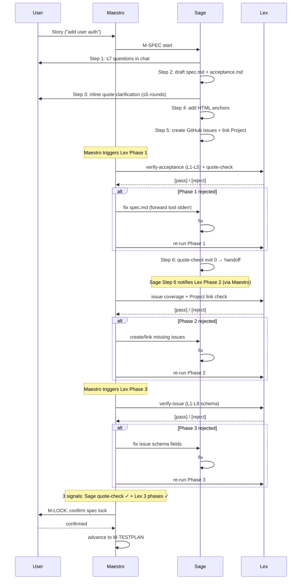

# Lòukè - beyond vibes, into Lòukè(craft)


[🇨🇳 中文](README.zh.md) · [🇺🇸 English](README.md)

**Lòukè is a spec-first, test-driven, tool-aligned multi-agent collaborative development method.**

---

## 1. Why Lòukè?

You can't build real software with a one-line vibe-coding prompt. When vibecoding:

- You haven't figured out what you want, yet you expect the agent to know
- Words are suggestive and leave too much room for imagination, but software must be precise
- You tell many Stories, but neither the AI nor you has formed a complete blueprint

Real software has hundreds to thousands of sub-requirements and tens of thousands of execution paths and boundary conditions.

We must rely on concrete, detailed specs, acceptance criteria, and test plans. Humans must participate in and guide the production of these documents; tools must break them into traceable sub-items so agent code maps one-to-one to those items. Only then can we build a retractable, traceable, trustworthy software production process.

That is the value of Lòukè. Beyond vibecoding — agent programming becomes precision manufacturing, executing every detail you specified perfectly.

Even spec-kit / superpowers / oh-my-openagent don't turn spec into a "programming contract." For spec to be a contract, three things must hold simultaneously:

- **Sub-requirements are orthogonal** — non-conflicting and non-overlapping, already pruned by Occam's razor.
- **Right-sized granularity** — an agent cannot read a 10,000-word document and still grasp every small detail, unless you break items into tasks that fit cleanly into a PR.
- **Traceable** — every thread from requirement to code to test must be bidirectionally traceable: forward to find the source, backward to find the landing. Any requirement without matching code and tests is a blank check hanging on the wall.

And Lòukè differs from these frameworks in philosophy: Lòukè turns this into **Infrastructure-as-Checkpoint** — the traceable loop is not in the AI's self-discipline, but in the forced execution of external CLIs at commit-time. `exit 0/1` is an OS process return value; you can't bypass it. The engineering world only recognizes this one language.

Programmers make mistakes — that's why we have tests. Agents make mistakes too. Don't rely on AI self-discipline; rely on rigorously aligned specs and tools.

## 2. How Does Lòukè Achieve This?

Lòukè turns the contract's three principles into five observable things. Each maps to an `lk` command or a traceable artifact — not just prompts, but tools:

- **spec → GitHub issue, commits must reference issue** — Lex converts each FR into an issue; Devon's commit message enforces `#NNN` format. Requirement to code, one-way trace, never lost

- **test ↔ AC-FRXXXX-YY auto-association, CI static validation closes both directions** — every test docstring must carry an `AC-FRXXXX-YY` ID. `lk agent archer ci-scan` validates at commit-time: every AC must be referenced by a test, every test must reference an AC. If the loop doesn't close, merge is blocked

- **Anti-pattern CI gate + identity consistency check** — `lk agent keeper gate` statically scans 8 anti-patterns (`assert True` / `try/except: pass` / no-issue skip / mock framework core / ...). `lk agent scout identity-check` locks gh/git identity consistency before workflow start. Violations block

- **Project wiki auto-distillation** — based on LLM compounding engineering, `.louke/raw/` (each agent's session records) → `.louke/wiki/` (structured knowledge). Facts, decisions, current state at a glance, lint-checkable

- **Socratic requirement interrogation** — Sage asks multiple rounds of questions around a vague story until it produces traceable `spec.md` + `acceptance.md`

Lòukè defines 12 specialized agents, a 10-stage pipeline, and an `lk` CLI — so every transition is a real check, not the soft "agents review each other." Each agent has its own dedicated toolbox; at every hold point, work is gated for verification.

## 3. Lòukè vs Others

| Framework                                 | Is spec a contract?                                                          | Who reviews                                                                   | Enforcement layer                           | spec → code → test loop                                     |
| ----------------------------------------- | ---------------------------------------------------------------------------- | ----------------------------------------------------------------------------- | ------------------------------------------- | ----------------------------------------------------------- |
| **spec-kit** (GitHub)                     | spec.md is the source, but no MECE / granularity / traceability constraints | No review                                                                     | None                                        | Manual + social                                             |
| **superpowers** (obra, 240k★)             | plan.md is plain text, no AC numbering, no commit-time validation            | subagent review (same model reviewing itself)                                 | prompt-level self-discipline               | TDD indirect guarantee (no ID binding between test and spec) |
| **oh-my-openagent** (code-yeongyu, 64k★)  | agents digest spec themselves                                                | team of agents (same LLM, different prompts)                                  | hooks / middleware                          | task self-defined, no FR ↔ test binding                      |
| **Lòukè**                                 | FR-XXXX / AC-FRXXXX-YY + `lk agent archer ci-scan`                                  | 12 different personas (implementer ≠ reviewer, cross-stage context disjoint)  | `lk` CLI exit 0/1 (OS process return value) | FR ↔ issue ↔ commit ↔ AC ↔ test end-to-end                   |

## 4. Architecture


- **10 canonical semantic Agents** = implementer ≠ reviewer; deterministic gates
  belong to Runtime programs
- **`lk` CLI** = OS-process-level contract; `exit 0/1` is unbypassable
- **Two-tier memory** = `raw/` (episodic) + `wiki/` (distilled), maintained by Librarian
- **Promise** = spec → code → test three-segment bidirectional reachability; breakage at any node can be traced to its source

## 5. Pipeline

| Stage        | Implementer     | Reviewer              | Notes                                                     |
| ------------ | --------------- | --------------------- | --------------------------------------------------------- |
| M-FOUND      | Runtime program | none                  | Project setup + foundation check                         |
| M-SPEC       | Sage            | Lex                   | spec + FR → issue                                         | Lex reviews + 100% verifies |
| M-TESTPLAN   | Archer          | Sage                  | Test plan (Sage has unique spec context)                  |
| M-ARCH       | Archer          | Prism                 | Architecture + interfaces                                 |
| M-LOCK       | Maestro         | User                  | 3-signal lock                                             |
| M-DEV        | Devon           | **Prism → Runtime ★** | Code + unit tests                                         |
| M-E2E        | Shield          | **Prism → Runtime ★** | e2e tests                                                 |
| M-BUGFIX     | Devon           | **Runtime ★**         | Bug fixes                                                 |
| M-SECURITY   | Judge (S-level) | User                  | Deep security audit                                       |
| M-MILESTONE  | Librarian       | Maestro               | raw → wiki distillation                                   |

★ **HOLD POINT** — tool-enforced check (`lk` CLI returns 0/1; pipeline doesn't advance until it passes). `★` only marks the PROD gate that blocks merge at commit-time; stage-transition hold points are not separately marked.

**Principle: implementer ≠ reviewer. Always.**

### 5.1 M-SPEC Internal: Sage ↔ Lex Three-Phase Interaction

M-SPEC is **not** "Sage produces spec → Lex reviews once at the end." Lex runs three phases at three distinct trigger points. Maestro must actively trigger Phase 1 and Phase 3 (Phase 2 is handed off by Sage Step 6, but still routed through Maestro). Skipping any phase makes the M-LOCK Lex signal invalid.



**Key rules**:
- Phase 1 failure → fix spec only; Phase 2 failure → fix issues only; Phase 3 failure → fix issue schema fields only
- If a fix reveals an upstream root cause → regress to M-SPEC and re-run from Phase 1
- Maestro forwards tool raw output (stderr/stdout) to Sage on rejection — never paraphrases

## 6. The 12 Agents

Each agent has a default primary model (with an in-tier fallback). Override via `~/.louke/models.json` (user-level) or `.louke/models.json` (project-level); use `lk models list` / `lk models doctor` to check current bindings, `lk models bind <abstract> <full>` to override.

### 6.1 Agent Permissions (v0.14)

Canonical semantic Agents have explicit `permission:` blocks. Runtime owns
foundation, quality, regression, and workflow state checks. Legacy names are
compatibility-only CLI adapters and are not semantic Agents or board prompts.

| Agent | Mode | `question` | `edit` | Notes |
|---|---|---|---|---|
| **Maestro** | `primary` | ❌ | ✅ | Conductor; `task: allow` to dispatch subagents; `external_directory: ask`; 13 keys |
| **Judge** | `subagent` | ✅ | ❌ | Read-only security auditor; 11 keys; can ask user clarifying questions |
| **Archer** | `subagent` | ✅ | ✅ | Writes spec artifacts; 11 keys; path restriction via prompt |
| **Librarian** | `subagent` | ❌ | ✅ | Writes wiki; 11 keys; path restriction via prompt |
| **Sage** | `subagent` | ✅ | (default) | Interactive spec clarification |
| Lex / Devon / Shield / Prism / Librarian | `subagent` | ❌ | `task: deny`, `question: deny` | Non-interactive; explicit permission block |

> Run `lk agent lint` to verify all agent frontmatter conforms.

### 6.2 Layered Orchestration (v0.14)

**Maestro is the only `mode: primary` agent.** Semantic subagents do not appear in
OpenCode's `<Leader>a` list. Maestro routes intent and summarizes evidence; Runtime
dispatches deterministic programs and owns workflow state.

- Users see **only** Maestro in `<Leader>a`
- Maestro dispatches work to subagents in isolated child sessions
- Subagent `question` calls bubble to the **main window** (verified 2026-07-03)
- Users never need to press `<Leader>a` to switch primary agents
- After a subagent completes, focus auto-returns to Maestro
- For viewing a subagent's context, press `<Leader>+Down` to enter / `<Leader>+Up` to return

### 6.3 Canonical semantic Agents (reference)

| Agent          | Role                                             | Tier    | Open-source example  | Closed-source example (reference)           |
| -------------- | ------------------------------------------------ | :-----: | -------------------- | ------------------------------------------- |
| **Maestro**    | Conductor — orchestrates the pipeline            | A       | `minimax-m3`         | `gpt-5.6`, `fable`                         |
| **Sage**       | The wise — Socratic requirement interrogation   | A       | `glm-5.2`            | `gpt-5.6`, `fable`                         |
| **Judge**      | Arbiter — S-level deep security audit           | S       | `minimax-m3`         | `gpt-5.6`, `fable`                         |
| **Archer**     | Marksman/architect — test-plan + architecture   | S/A     | `glm-5.2`            | `gpt-5.6`, `fable`                         |
| **Devon**      | Smith — R-G-R coding                            | A       | `kimi-2.7-code`      | `opus-4.8`, `gpt-5.5`                      |
| **Prism**      | Prism — multi-angle code review (anti-pattern + security) | A | `deepseek-v4-pro` | `opus-4.8`, `gpt-5.5`                   |
| **Shield**     | Shield — writes e2e test scripts                | A       | `kimi-2.6`           | `opus-4.8`, `gpt-5.5`                      |
| **Lex**        | The law — spec-level structural validation      | B       | `deepseek-v4-flash`  | `gpt-5.4-mini`, `gpt-5.4`, `sonnet-4.6`    |
| **Librarian**  | Librarian — distills Wiki, preserves memory     | B       | `minimax-2.7`        | `gpt-5.4-mini`, `gpt-5.4`, `sonnet-4.6`    |

`lk agent scout|warden|keeper` remains available only as deprecated
compatibility adapters for existing scripts. They call the same Runtime programs,
create no semantic Agent session, and do not write stage authority.

## 7. Usage Guide
### 7.1. Install

> **Platform**: macOS / Linux. Windows users: please use [WSL2](https://learn.microsoft.com/en-us/windows/wsl/) or Docker. `install.sh` self-checks `uname -s` and exits with a clear error on unsupported platforms.

```bash
# Standard pip-based install (recommended): auto-creates venv, sets PATH, links lk to ~/.local/bin
curl -sSL https://raw.githubusercontent.com/zillionare/louke/main/install.sh | bash

# Or pin a version
curl -sSL https://raw.githubusercontent.com/zillionare/louke/main/install.sh | bash -s -- v0.3.0

# Or dev mode (clone + editable install)
git clone https://github.com/zillionare/louke
cd louke
./install.sh --editable

# Verify
lk --help
```

`install.sh` does four things:

1. Creates an isolated venv at `~/.louke/venv/` (no system-Python pollution)
2. `pip install louke` into that venv
3. `~/.local/bin/lk` → symlink to venv's `lk`, and appends PATH to your shell rc
4. Verifies the install + prints uninstall instructions

Uninstall: `rm -rf ~/.louke/venv ~/.local/bin/lk`

### 7.2. 30-Second Start

```bash
# New project (creates <name>/ dir with .louke/ skeleton + OpenCode agents + issue template + CI workflow)
lk init my-project
cd my-project

# Adopt existing git repo (non-destructive, adds .louke/ alongside your code)
cd ~/work/my-existing-repo && lk init .
```

`lk init` does:

1. Scaffolds the project layout (`.louke/{templates,project,project/specs,wiki/pages,wiki/decisions,raw}/`)
2. Copies louke's bundled templates (spec / acceptance / prd / bug-fix / …) into `.louke/templates/`
3. Installs `.github/ISSUE_TEMPLATE/feature.yml` (4-digit FR schema) + `.github/ISSUE_TEMPLATE/bug.yml`
4. Writes `default_agent: maestro` to project-level `opencode.json`
5. Generates `.opencode/agents/*.md` from the louke package's installed agent prompts (each agent with its resolved `model:` field). Re-run with `lk board opencode` any time you upgrade louke.
6. Optionally installs the daily wiki-distillation cron (`--no-cron` to skip)

> **Agents are package-owned.** The 12 agent prompts live inside the installed `louke` Python package — there is intentionally no project-side copy you can (or should) edit. `lk board opencode` materialises them into `.opencode/agents/` so OpenCode can consume them. Past attempts to let projects override agents were removed because they caused stale-format drift.

Then start OpenCode — the default primary agent is **Maestro**. Just tell it what you want in chat, for example:

> "We want to add user authentication — username/password login, plus Google login."

From here on, Maestro orchestrates the entire pipeline. You don't need to switch agents manually; Sage's follow-up questions and Judge's security findings all flow back to you through Maestro.

### 7.3. What a Full Session Looks Like

Using "add user authentication" as an example, the timeline unfolds linearly:

1. **M-FOUND** — `lk agent scout foundation` creates repo, GitHub Project, Test Issue to verify permissions
2. **M-SPEC** — Sage asks follow-ups in chat (MFA? session timeout? rate limiting?); Lex finds 3 structural issues; Sage fixes them. Locked when **3 signals align**: `lk agent sage quote-check` exit 0 + Lex 3 stages pass + your IDE confirmation
3. **M-TESTPLAN** — Archer writes `test-plan.md` (3-layer strategy + AC traceability + anti-pattern rules); Sage reviews (holds M-SPEC's unique context)
4. **M-ARCH** — Archer writes `architecture.md` + `interfaces.md`; Prism checks spec/code consistency
5. **M-LOCK** — Spec locked. Implementation begins
6. **M-DEV** — Devon codes R-G-R. Each commit prefixed `test: red` / `feat: green` / `refactor`. Prism reviews (anti-patterns + security quick scan); `lk agent keeper gate` checks commit format + tests
7. **M-E2E** — Shield writes e2e (B-level, fixed methods: Playwright/testclient/DB); same Prism + Keeper
8. **M-SECURITY** — `lk agent judge security-audit` does pattern scan + S-level semantic review. **You** make the final call
9. **M-MILESTONE** — `lk agent librarian distill` distills the session to wiki; `lk agent maestro advance --stage M-MILESTONE` closes the milestone

Each step is a different agent; each hold point is tool-enforced; each handoff is an explicit trace.

The above flow is automatically orchestrated by Maestro — you just tell Maestro in OpenCode "do user authentication," and it will sequentially invoke Scout/Sage/Lex/Archer/Devon/Shield/Judge/Librarian. Below is what you see (through your conversation with Maestro) at each step.

### 7.4. Configuring Agent Models

New models are released every month. You may need to dynamically adjust agent models. Each agent has a default model; switching coding agents to local small models in day-to-day development saves most of the tokens.

```bash
# View current bindings
lk models list
lk models doctor            # Check for missing/failed resolutions

# Temporarily switch an agent to a cheaper model
lk models bind devon kimi-2.7-code
lk models unbind devon       # Restore default
```

`models.json` priority: **project-level** (`.louke/models.json`) > **user-level** (`~/.louke/models.json`).

### 7.5. Sage's Requirement Discussion — Back to Inline Email!

After receiving the Story, Sage immediately starts a round of requirement clarification in the chat window, but will ask fewer than 7 questions. Deeper questions are better clarified outside of chat. Lòukè brings back the inline comment style from email.

We use Markdown quote blocks to start the discussion:

````markdown
### FR-0100 Draw a circle

| Valid | Testable | Decided |
| ----- | -------- | ------- |
| ✅     | ✅        | ⚠️       |

You shall draw a circle with a radius of 0.5m.

> Sage: How should the pen color and stroke width be determined?
````

Sage thinks this requirement is not clear enough to verify. So he asks: how should the pen color and stroke width be determined?

You reply with **one more level of `>`** indentation:

````markdown
> Sage: How should the pen color and stroke width be determined?
>> Aaron: Provide a toolbar and let the user choose
>>> Sage: Requirement confirmed.
````

This is standard email threading syntax. If you think the spec wording is wrong and doesn't need discussion, you can directly edit the spec; Sage will find your changes through git diff, and if there are any questions, will open a session.

### 7.6. GitHub Projects: Managing Releases

Lòukè uses GitHub Projects to manage releases. A release starts with a Story. Sage breaks down the requirements, creates GitHub issues, and automatically links them to the GitHub Project. Release Notes naturally derive from this project.

We also throw in a small gift — by creating a project named `{repo}-backlog`, we give you an idea collection box. If you have an inspiration that can't fit into the current release, you'll find this project surprisingly useful. Future releases start their planning from here.

`lk agent scout foundation` creates two Projects per repo:

- **`{repo}-{version}`** — per-release, tracks the current milestone's issues
- **`{repo}-backlog`** — per-repo (permanent), holds unscheduled ideas

Issues created with `gh issue create --no-milestone` naturally land in the backlog; during planning, pull backlog issues into the current release with `gh project item-add`.

### 7.7. pre-commit Quality Gate

Lint, format, typecheck, and tests run automatically at commit time via the project's `.pre-commit-config.yaml` — no tokens spent, no manual invocation. Bypassing hooks with `--no-verify` is an anti-pattern because it breaks the Infrastructure-as-Checkpoint contract. See `louke/templates/pre-commit/README.md` for the bundled templates.

## 8. Quick Command Reference

### 8.1. Project Initialization
lk init my-project                         # New project
lk init .                                  # Adopt existing repo
lk agent scout foundation --repo owner/repo --version v0.1 --spec-id v0.1-001-init
lk agent scout identity-check --repo owner/repo
lk agent scout invite-owner owner/repo --version v0.1

### 8.2. Pipeline Advancement
lk agent maestro status                          # View current stage
lk agent maestro advance --stage M-DEV           # Advance to next stage
lk agent maestro regress --stage M-SPEC --reason "spec missing NFR"
lk agent maestro escalate --reason "user unresponsive for 3 rounds"

### 8.3. Code Quality
lk agent archer ci-scan --spec ID                # AC traceability validation
lk agent keeper gate                             # commit format + R-G-R order + anti-pattern scan
lk agent judge security-audit --release releases/v0.1

### 8.4. Model Management
lk models list                             # View agent→model bindings
lk models doctor                           # Diagnose missing/failed resolutions
lk models bind devon kimi-2.7-code         # Temporary override
lk models unbind devon

### 8.5. Wiki
lk agent librarian lint                          # Health check
lk agent librarian distill                       # Distill raw sessions to wiki pages

## 9. Troubleshooting

**`lk: command not found`** — `~/.local/bin` is not in PATH. Add `export PATH=$HOME/.local/bin:$PATH` to your shell rc and `source` it (or restart your terminal).

**`lk agent scout foundation` fails with `gh not authenticated`** — Run `gh auth login` first, then `lk agent scout identity-check` to verify.

**Sage keeps asking about the same requirement** — Possible causes:
- Your reply didn't use an extra level of `>` indentation, so Sage didn't recognize it as a new reply
- You directly edited the text — Sage will discover the change through git diff and ask for confirmation. Reply with "✓ resolved" on the changed section

**Commit blocked by `lk agent keeper gate`** — The terminal prints which anti-pattern was hit. Common causes:

- Commit message doesn't follow R-G-R prefix conventions (e.g., wrote `feat: add login` instead of `feat: green add login`)
- `feat: green` appears before `test: red` (R-G-R order violation)
- Test docstring missing `AC-FRXXXX-YY`
- Wrote `assert True` / `try/except: pass` / mocked framework core

**OpenCode doesn't show the 12 agents after launch** — Check the `.opencode/agents/` directory and `opencode.json`'s `default_agent` field; rerun `lk init --force` if needed.

**Wondering "where are we now"** — `lk agent maestro status` tells you in one line.

## 10. Future Enhancements (Not in v0.6-008 Scope)

- **[#78](https://github.com/zillionare/louke/issues/78)** — `.louke/project` as a standalone private GitHub repo (via git submodule), separating spec/wiki from public code
- **[#79](https://github.com/zillionare/louke/issues/79)** — `louke serve` web UI for browsing/editing wiki / spec / acceptance / test-plan

## 11. License

MIT

## 12. Release History

Louke releases follow [Semantic Versioning](https://semver.org/). The CLI (`lk`) self-updates via `pip install --upgrade louke`; project-local state (`.louke/`, `~/.louke/models.json`) is preserved across upgrades. Agent prompts come from the installed package, so upgrading louke automatically ships any agent-prompt changes — re-run `lk board opencode` to refresh `.opencode/agents/`.

### v0.6.0 — v0.6.13 (2026-07-04)

| Version | Highlights |
|---|---|
| **v0.6.13** | `lk models doctor` critical bugfix: `ok` variable shadowed imported `ok` function (same pattern as v0.6.8 fix in `set-model`, but missed in `doctor`). Crash on any aliased model. Regression test added. |
| v0.6.12 | Cleanup: removed internal spec references (`(v0.6-008 FR-0710)`, `(FR-0070)`, etc.) from 6 agent prompts shipped to users. |
| v0.6.11 | Cleanup: removed redundant `(实测确认 2026-07-03 14:00 by Aaron)` annotations from 4 interactive subagent prompts. |
| v0.6.10 | Subagent dispatch clarification: `louke/agents/Maestro.md` now explicitly says "只**用 `task` 工具调子 agent, 不要用 `opencode run`". Spec FR-0070.7 documents the two invocation modes (production TUI vs CLI test). |
| v0.6.9 | `lk agent set-model` redesign: writes directly to `.opencode/agents/<name>.md` (output) instead of the package source. **Temporary** — next `lk board opencode` regenerates from the package source. |
| v0.6.8 | `lk agent set-model` bugfix: `ok` variable shadowed imported `ok` function → `TypeError: 'bool' object is not callable`. |
| v0.6.7 | `lk agent list-models` — table view of all agents' `models:` chain + current resolved model. `--unbound-only` flag. |
| v0.6.6 | `lk agent set-model <name> <abstract>` — change an agent's primary model in one command. Interactive bind + probe before save. |
| v0.6.5 | `lk models bind` probes the selected model via `opencode run --model <m> "ping"` before saving. Prompts `[r]etry / [s]kip / [a]ssign-force` on failure. |
| v0.6.4 | `lk board opencode` requires a git repository (or explicit `--root <path>`). Prevents accidental file creation in random directories. |
| v0.6.3 | `lk models bind` ranking: Levenshtein distance over substring matching. Better top-1 candidates for naming-style mismatches (e.g. `kimi-2.6` ↔ `kimi-k2.6`). |
| v0.6.2 | Progress output for `lk board opencode` and `lk models doctor`: 5-step / 4-step numbered output with ANSI colors (✓/✗/⚠) and Spinner on subprocess calls. |
| v0.6.1 | Source `louke/agents/*.md` updated to v0.6.0 style (`mode: primary/subagent`, `permission:` block). |
| v0.6.0 | Agent permission tightening + layered orchestration. 4 roles (Warden / Judge / Archer / Librarian) + Maestro get explicit `permission:` blocks (11-13 keys). 11 agents set to `mode: subagent`; Maestro is the sole `mode: primary`. |

### v0.3.0 (2026-06-29) — Initial public release

12 specialized agents, 10-stage pipeline (M-FOUND → M-MILESTONE), `lk init` / `lk agent scout foundation` / `lk agent archer ci-scan` / `lk agent keeper gate`, OpenSpec-style YAML issue template, 129 bats tests.

---

For older (pre-v0.6) release notes, see `.github/RELEASE_NOTES_v0.X.md`.
