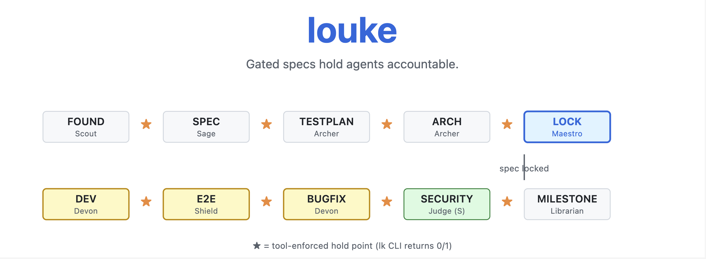

# LouKe - beyond vibes, into Louke(craft)



[🇨🇳 中文](README.zh.md) · [🇺🇸 English](README.md)

**louke is a multi-agent collaborative development methodology built on spec-first, test-driven, and tool-aligned agent behavior.** Every stage transition is a tool-enforced check.

---

### Supported environments

| Dimension | Supported | Notes |
| --- | --- | --- |
| **OS** | macOS, Linux | **No native Windows.** Use [WSL2](https://learn.microsoft.com/en-us/windows/wsl/) or Docker. `install.sh` self-checks `uname -s` and exits with a clear error otherwise. |
| **IDE / Agent host** | **OpenCode only** (currently) | Claude Code, Cursor, Continue, Copilot, Kilo are **not supported** in this release. The agent prompts are plain Markdown so other hosts *can* read them, but `default_agent` wiring, plugin install paths, and hold-point UX are validated against OpenCode only. |

If you need another host, open an issue — do not assume parity.

---

### Why louke?

You can't build a real software with one-sentence vibecoding.

A real software has hundreds to thousands of sub-requirements, tens of thousands of execution paths and boundary checks.

Real work takes concrete, detailed specs, acceptance criteria, and test plans. Humans must participate in and guide the production of these documents; tools must break them into traceable sub-items so agent code maps one-to-one to those items. Only then can we build a retractable, traceable, trustworthy software production process.

That's the value of louke. Beyond vibecoding — agent programming becomes precision manufacturing, executing every detail you specified perfectly.

When vibecoding:

- You haven't figured out what software you want, yet expect the agent to know
- Words are always suggestive and leave too much room for imagination, but software must be precise
- You have many Stories, but neither AI nor you has formed a complete blueprint

Even spec-kit / superpowers / oh-my-openagent don't turn spec into a "programming contract". For spec to be a contract, three things must hold simultaneously — and louke is the only one that achieves them:

- **Sub-requirements are orthogonal** — non-conflicting and non-overlapping, already pruned by Occam's razor
- **Right-sized granularity** — you can't expect an agent to read a 10,000-word document and still grasp every small detail, unless you break them into items that fit cleanly into a PR
- **Traceable** — every thread from requirement to code to test must be bidirectionally traceable: forward to find the source, backward to find the landing. Any requirement that can't be matched to its code and tests is a blank check hanging on the wall

And the deepest gap between louke and other frameworks: louke turns this into **Infrastructure-as-Checkpoint** — the traceable loop is not in the AI's self-discipline, but in the forced execution of external CLIs at commit-time. `exit 0/1` is an OS process return value; you can't bypass it. The engineering world only recognizes this one language.

### What louke provides

louke turns the contract's three principles into 5 observable things. Each maps to an `lk` command or a traceable artifact — not just prompts, but tools:

- **spec → GitHub issue, commits must reference issue** — Lex converts each FR into an issue; Devon's commit message enforces `#NNN` format. Requirement to code, one-way trace, never lost

- **test ↔ AC-FRXXXX-YY auto-association, CI static validation closes both directions** — every test docstring must carry an `AC-FRXXXX-YY` ID. `lk archer ci-scan` validates at commit-time: every AC must be referenced by a test, every test must reference an AC. If the loop doesn't close, merge is blocked

- **Anti-pattern CI gate + identity consistency check** — `lk keeper gate` statically scans 8 anti-patterns (`assert True` / `try/except: pass` / no-issue skip / mock-framework core / ...). `lk scout identity-check` locks gh/git identity consistency before workflow start. Violations block

- **Project wiki auto-distillation** — based on LLM compounding engineering, `.louke/raw/` (each agent's session records) → `.louke/wiki/` (structured knowledge). Facts, decisions, current state at a glance, lint-checkable

- **Socratic requirement interrogation** — Sage asks multiple rounds of questions around a vague story until it produces traceable `spec.md` + `acceptance.md`

`louke` defines 12 specialized agents, a 10-stage pipeline, and an `lk` CLI — so every transition is a real check, not the soft "agents review each other". Each agent has its own dedicated toolbox; at every hold point, work is gated for verification.

### The Pipeline

| Stage       | Implementer     | Reviewer             | Notes                                                           |
| ----------- | --------------- | -------------------- | --------------------------------------------------------------- |
| M-FOUND     | Scout           | Warden               | Project setup + permission gate                                 |
| M-SPEC      | Sage            | Lex                  | spec + FR → issue, Lex reviews + 100% verifies                  |
| M-TESTPLAN  | Archer          | Sage                 | Test plan (Sage has unique spec context)                        |
| M-ARCH      | Archer          | Prism                | Architecture + interfaces                                       |
| M-LOCK      | Maestro         | User                 | 3-signal lock (Sage quote-parser + Lex 3 stages + User confirm) |
| M-DEV       | Devon           | **Prism → Keeper ★** | Code + unit tests                                               |
| M-E2E       | Shield          | **Prism → Keeper ★** | e2e tests (B-level)                                             |
| M-BUGFIX    | Devon           | **Keeper ★**         | Bug fixes                                                       |
| M-SECURITY  | Judge (S-level) | User                 | Deep security audit                                             |
| M-MILESTONE | Librarian       | Maestro              | raw → wiki distillation                                         |

★ **HOLD POINT** — tool-enforced check (`lk` CLI returns 0/1; pipeline doesn't advance until it passes). `★` only marks the PROD gate that blocks merge at commit-time; stage-transition hold points aren't separately marked.

**Principle: implementer ≠ reviewer. Always.**

### Naming

The 12 agents are named for what they do, not for decoration:

| Agent         | Meaning              | Job image                                                                        |
| ------------- | -------------------- | -------------------------------------------------------------------------------- |
| **Maestro**   | Conductor            | coordinates the whole ensemble                                                   |
| **Scout**     | Pathfinder           | scouts the terrain, verifies preconditions                                       |
| **Warden**    | Gatekeeper           | guards the door, confirms exit conditions                                        |
| **Sage**      | The wise             | asks Socratic questions                                                          |
| **Lex**       | The law              | enforces spec-level precision + organizes issues                                 |
| **Archer**    | Marksman / architect | designs the execution path (test-plan + architecture)                            |
| **Devon**     | Smith                | forges code from the fire of tests (R-G-R)                                       |
| **Prism**     | Prism                | refracts code through multiple angles (test anti-patterns + security quick scan) |
| **Judge**     | Arbiter              | S-grade deep security audit                                                      |
| **Shield**    | Shield               | writes end-to-end scripts (B-grade)                                              |
| **Keeper**    | Warden of gates      | enforces quality gates (commit format + tests + lint + regression)               |
| **Librarian** | Librarian            | distills Wiki, preserves project memory                                          |

### Install

> **Platform support**: macOS and Linux only. Windows users: please use [WSL2](https://learn.microsoft.com/en-us/windows/wsl/) or Docker. The installer self-checks `uname -s` and exits with a clear error on unsupported platforms.

```bash
# Standard pip-based install (recommended): auto-creates venv, sets PATH, links lk to ~/.local/bin
curl -sSL https://raw.githubusercontent.com/zillionare/louke/main/install.sh | bash

# Or pin a version
curl -sSL https://raw.githubusercontent.com/zillionare/louke/main/install.sh | bash -s -- v0.3.0

# Or dev mode (clone + editable install)
git clone https://github.com/zillionare/louke
cd louke
./install.sh --editable

# Verify
lk --help
```

`install.sh` does 4 things:

1. Creates an isolated venv at `~/.louke/venv/` (no system-Python pollution)
2. `pip install louke` into that venv
3. `~/.local/bin/lk` → symlink to venv's `lk`, and appends PATH to your shell rc
4. Verifies the install + prints uninstall instructions

Uninstall:

```bash
rm -rf ~/.louke/venv ~/.local/bin/lk
```

You now have:
- `lk` CLI (32 commands, 12 agents)
- `templates/` — 4 doc templates (spec, acceptance, test-plan, security-checklist)
- `louke/_tools/` — Python scripts wrapped by `lk`

### Use in Your Project

Initialize via `lk scout foundation`:

```bash
lk scout foundation --repo YOUR_ORG/YOUR_REPO --version v0.1 --spec-id v0.1-001-init
# → creates .louke/project/project-info.md
# → creates .louke/project/specs/v0.1-001-init/story.md
# → opens editor for you to fill in story (interactive)
```

`lk scout foundation` walks you through:
1. Step 1 — Collect story/version/repo/DoD (interactive)
2. Step 2 — Create repo + project + permissions
3. Step 3 — Verify gh + git identity
4. Step 4 — Run `lk warden foundation-check` (F1-F11 automated checks)
5. Step 5 — Commit + push

### Use with Your AI Assistant

> **Currently only OpenCode is supported as the agent host.** See *Supported environments* above. The instructions below assume OpenCode.

#### OpenCode

Add the framework as a plugin in `~/.config/opencode/opencode.json`:

```json
{"plugin": ["louke"]}
```

After install, the default primary agent is set to **Maestro**, so any new session routes through the pipeline orchestrator rather than dropping you straight into a specialist. (Maestro will then dispatch to Scout / Sage / Lex / Archer / Devon / Keeper / Judge / Librarian as the workflow demands.)

If you ever need to switch manually inside OpenCode: press `<leader>a` (or `/agents`) and pick Maestro from the list.

### A Working Session

In a typical session with OpenCode:

```
1. lk scout foundation            # Initialize project, verify permissions
2. "You are Sage. Interview me about user auth."   # AI plays Sage role
3. lk sage commit-spec --spec ...  # Commit spec + acceptance
4. lk lex verify-acceptance       # [HOLD POINT] Different agent, tool-enforced
5. "You are Archer. Write test-plan + arch + interfaces."
6. lk archer ci-scan              # AC reference + anti-pattern scan
7. "You are Devon. Implement in R-G-R."
8. lk devon commit-rgr --phase red/green/refactor
9. lk keeper gate                 # [HOLD POINT] Tool-enforced commit format
10. lk judge security-audit       # [HOLD POINT] S-level security review
11. lk librarian from-raw         # Distill session → wiki
12. lk maestro status             # Check progress
```

Each `★` HOLD POINT returns 0 (pass) or 1 (fail). The pipeline doesn't advance until it passes.

### How It Works: One Spec, End to End

Say you want to build user auth:

1. **M-FOUND** (Scout) — `lk scout foundation` creates the repo, GitHub Project, and a Test Issue to verify permissions.
2. **M-SPEC** (Sage → Lex) — Sage interviews you Socratically (MFA? session timeout? rate limiting?). Lex finds 3 issues. Sage fixes, marks spec locked when **3 signals align**: `lk sage quote-check` exit 0, Lex 3 stages pass, user confirms in IDE.
3. **M-TESTPLAN** (Archer → Sage) — Archer writes `test-plan.md` with 3-layer testing strategy + AC traceability + anti-pattern rules. Sage reviews (it has unique spec context from M-SPEC).
4. **M-ARCH** (Archer → Prism) — Archer writes `architecture.md` + `interfaces.md`. Prism checks spec/code consistency.
5. **M-LOCK** — Spec locked. Implementation begins.
6. **M-DEV** (Devon → Prism → Keeper) — Devon implements in R-G-R. Each commit prefixed `test: red`, `feat: green`, `refactor`. Prism reviews (cynical + test patterns + security quick scan). Keeper runs `lk keeper gate` (commit format + tests).
7. **M-E2E** (Shield → Prism → Keeper) — Shield writes e2e (B-level, simple methods: Playwright/testclient/DB). Same Prism + Keeper.
8. **M-SECURITY** (Judge S-level → User) — `lk judge security-audit` does pattern scan + S-level semantic review. User makes final call.
9. **M-MILESTONE** (Librarian → Maestro) — `lk librarian from-raw` distills the session to wiki. `lk maestro advance --stage M-MILESTONE` closes the milestone.

Each transition is a different agent. Each hold point is tool-enforced. Each handoff is explicit.

### How louke compares

| Framework                                | Is spec a contract?                                                         | Who reviews                                                                  | Enforcement layer                           | spec → code → test loop                                      |
| ---------------------------------------- | --------------------------------------------------------------------------- | ---------------------------------------------------------------------------- | ------------------------------------------- | ------------------------------------------------------------ |
| **spec-kit** (GitHub)                    | spec.md is the source, but no MECE / granularity / traceability constraints | No review                                                                    | None                                        | Manual + social                                              |
| **superpowers** (obra, 240k★)            | plan.md is plain text, no AC numbering, no commit-time validation           | subagent review (same model reviewing itself)                                | prompt-level self-discipline                | TDD indirect guarantee (no ID binding between test and spec) |
| **oh-my-openagent** (code-yeongyu, 64k★) | agents digest spec themselves                                               | team of agents (same LLM, different prompts)                                 | hooks / middleware                          | task self-defined, no FR ↔ test binding                      |
| **louke**                                | FR-XXX / AC-XXX-N + `lk archer ci-scan`                                     | 12 different personas (implementer ≠ reviewer, cross-stage context disjoint) | `lk` CLI exit 0/1 (OS process return value) | FR ↔ issue ↔ commit ↔ AC ↔ test end-to-end                   |

### Architecture (Light)

```
  agents/*.md              templates/*.md                louke/                louke/_tools/*.py
  (12 prompts)            (spec, acceptance,           (32 commands,         (Python scripts,
                          test-plan, security-          12 agents)           wrapped by lk)
                          checklist)
       │                       │                            │                      │
└───────────┬───────────┴────────────┬───────────────┘                      │
                    │                        │                                      │
                    ↓                        ↓                                      ↓
             AI assistant              Tool-enforced                            wrapped by lk
          (OpenCode — only          hold points
           host currently             (lk keeper gate,
           supported)                  lk judge
                                       security-audit)

  Two-tier memory:
    .louke/raw/    →   episodic, per-agent session records
    .louke/wiki/   →   distilled knowledge, maintained by Librarian
```

Four things louke doesn't compromise on:

- **12 Agents** = implementer ≠ reviewer; cross-stage context is disjoint
- **`lk` CLI** = OS-process-level contract; `exit 0/1` is unbypassable
- **Two-tier memory** = `raw/` (episodic) + `wiki/` (distilled), maintained by Librarian
- **Promise** = spec → code → test three-segment bidirectional reachability; breakage at any node can be traced to its source

### License

MIT
