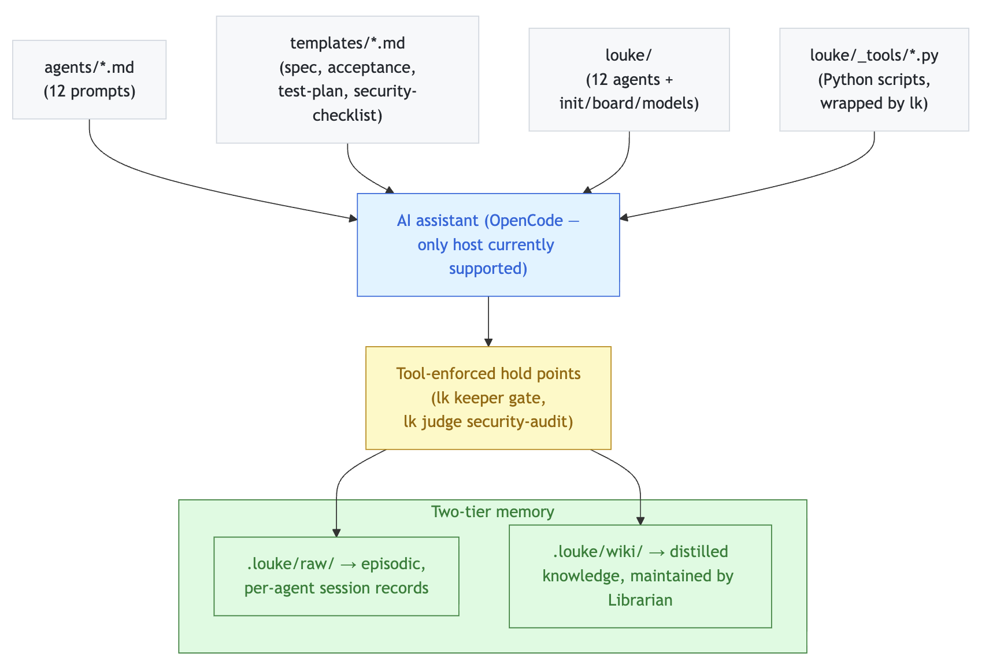

# 镂刻 - **超越氛围编程，自是精密镂刻**


[🇺🇸 English](README.md) · [🇨🇳 中文](README.zh.md)

**LouKe 是一套规格先行、测试驱动、工具对齐 Agent 行为的多 Agent 协作开发方法。** 

---

## 1. 为什么是 LouKe？

你不可能凭借一句话式的氛围编程就造出一个真正可用的软件。当我们进行氛围编程时：

- 你并没有想清楚想要一个什么样的软件，却希望 Agent 知道
- 文字始终是写意的，包含了很大的想象空间，而软件必须是精确的
- 讲述了许多 Story，但无论是 AI，还是你自己，都没有形成一个完整的施工图

一个真正可用的软件，它可能包含成百上千个子项需求，数以万计的执行路径和边界检查条件。

我们必须依赖具体、详尽的规范、验收标准和测试计划。人类必须参与、指导这些文档的生成，通过工具将它们拆解成为数以百（千）计的、可跟踪的子项目，让 Agent 的代码与这些子项目一一对应，才有可能构造成一个可回退、可追踪、可信的软件生产过程。

这就是镂刻的价值。超越氛围编程，把智能体编程变成精密制造，完美实现你规定的每一个细节。

即使是 spec-kit / superpowers / oh-my-openagent，依然没人把 spec 做成"编程契约"。一份 spec 要成为契约，得同时满足三件事：

- **子需求之间是正交关系** —— 子需求之间不矛盾、不重复，已经过奥卡姆剃刀的修剪。
- **颗粒度合适** —— 你不可能要求 Agent 能读完上万字的文档，并且还能把握住其中每一个小小的细节。除非你把它们拆成一项项可以完美装进一个 PR 的任务里。
- **可追踪** —— 从需求到代码到测试，每一条线索都必须可以双向追溯：向前能查到源头，向后能查到落点。任何一条需求如果找不到对应的代码和测试，它就是挂在墙上的空头支票。

而 LouKe 与这些框架相比，有着截然不同的设计哲学：LouKe 把所有这些做成了"基础设施即检查点"（Infrastructure-as-Checkpoint）——可追踪的闭环不在 AI 的自律里，而在外部 CLI 在 commit-time 的强制执行里。exit 0/1 是 OS 进程返回值，绕不过。工程世界只认这一种语言。

因为程序员会犯错，所以我们才有测试。Agent 也会犯错，不靠 AI 的自律，靠可被严格对齐的规范和工具。

## 2. LouKe 如何做到？

LouKe 把上面的契约三原则落到 5 件可观测的事上。每件都有一条 lk 命令或可追溯的产物对应——不只是 prompt，而是工具：

- **spec → GitHub issue，commit 必带 issue 引用** —— Lex 把每个 FR 自动转成一个 issue，Devon 的 commit message 强制 `#NNN` 格式。需求到代码，单向追溯，永不丢失

- **test ↔ AC-FRXXXX-YY 自动关联，CI 静态校验双向闭合** —— 每个测试 docstring 必带 `AC-FRXXXX-YY` 编号。`lk archer ci-scan` 在 commit-time 校验：每条 AC 必被测试引用，每个测试必引用 AC。不闭合，merge 阻断

- **反模式 CI 门禁 + 身份一致性检查** —— `lk keeper gate` 静态扫 8 类反模式（`assert True` / `try/except: pass` / 无 issue skip / mock 框架核心 等）。`lk scout identity-check` 在流程启动前锁定 gh/git 身份一致性。违规即阻塞

- **项目 wiki 自动蒸馏** —— 基于 LLM compounding engineering 理念，`.LouKe/raw/`（每 Agent 的会话记录）→ `.LouKe/wiki/`（结构化知识）。事实、决定、现状一目了然且可 lint

- **苏格拉底式需求询问** —— Sage 多轮追问模糊的 story，直到磨出可追踪的 `spec.md` + `acceptance.md`

`LouKe` 定义了 12 个专业 Agent、10 阶段流水线、一个 `lk` CLI——让每次转换都是真正的检查，不是"agent 互相 review"那种软约束。每个 Agent 都有自己专属的工具箱，在每个 holdpoint 上，工作被卡点验证。

## 3. LouKe vs 其它

| 框架                                      | spec 是不是契约？                               | review 由谁做                                          | 强制层                             | spec → code → test 闭环                |
| ----------------------------------------- | ----------------------------------------------- | ------------------------------------------------------ | ---------------------------------- | -------------------------------------- |
| **spec-kit**（GitHub）                    | spec.md 是源头，但无 MECE / 粒度 / 可追踪约束   | 无 review                                              | 无                                 | 手工 + 社交                            |
| **superpowers**（obra，240k★）            | plan.md 是文本，无 AC 编号，无 commit-time 校验 | subagent review（同 model 自检）                       | prompt 级自律                      | TDD 间接保证（test ↔ spec 无 ID 绑定） |
| **oh-my-openagent**（code-yeongyu，64k★） | agent 自消化 spec                               | team of agents（同 LLM 不同 prompt）                   | hooks / middleware                 | task 自定，无 FR ↔ test 绑定           |
| **LouKe**                                 | FR-XXXX / AC-FRXXXX-YY + `lk archer ci-scan`    | 12 个不同 persona（实施者 ≠ 评审者，跨阶段语境不重叠） | `lk` CLI exit 0/1（OS 进程返回值） | FR ↔ issue ↔ commit ↔ AC ↔ test 全链路 |

## 4. 架构



<!--
  agents/*.md              templates/*.md                LouKe/                LouKe/_tools/*.py
  (12 prompts)            (spec, acceptance,           (12 agents +          (Python scripts,
                          test-plan, security-          init/board/models)   wrapped by lk)
                          checklist)
       │                       │                            │                      │
└───────────┬───────────┴────────────┬───────────────┘                      │
                    │                        │                                      │
                    ↓                        ↓                                      ↓
             AI 助手                    工具强制                              被 lk 包装
          (OpenCode ——               hold points
           当前唯一                   (lk keeper gate,
           支持的宿主)                   lk judge
                                       security-audit)

  两层记忆:
    .LouKe/raw/    →   事件级, per-agent 会话记录
    .LouKe/wiki/   →   蒸馏后的知识, 由 Librarian 维护
-->

- **12 Agent** = 实施者与评审者是不同 persona，跨阶段语境不重叠
- **`lk` CLI** = OS 进程级合同，`exit 0/1` 不可绕过
- **两层记忆** = `raw/`（事件级）+ `wiki/`（蒸馏级），由 Librarian 维护
- **承诺** = spec → code → test 三段双向可达，任一节点断裂都查得到源头

## 5. 流水线

| 阶段        | 实施者        | 评审者               | 说明                                |
| ----------- | ------------- | -------------------- | ----------------------------------- |
| M-FOUND     | Scout         | Warden               | 项目奠基 + 权限门                   |
| M-SPEC      | Sage          | Lex                  | spec + FR → issue                   | Lex 审 + 100% 验 |
| M-TESTPLAN  | Archer        | Sage                 | 测试计划（Sage 有独有 spec 上下文） |
| M-ARCH      | Archer        | Prism                | 架构 + 接口                         |
| M-LOCK      | Maestro       | 用户                 | 3 信号锁定                          |
| M-DEV       | Devon         | **Prism → Keeper ★** | 代码 + 单元测试                     |
| M-E2E       | Shield        | **Prism → Keeper ★** | e2e 测试                            |
| M-BUGFIX    | Devon         | **Keeper ★**         | Bug 修复                            |
| M-SECURITY  | Judge（S 级） | 用户                 | 深度安全审计                        |
| M-MILESTONE | Librarian     | Maestro              | raw → wiki 蒸馏                     |

★ **HOLD POINT**——工具强制检查（`lk` CLI 返回 0/1；不通过就不前进）。`★` 仅标 commit-time 阻断 merge 的 PROD gate；stage transition 的 hold point 不单独标。

**核心原则：实施者 ≠ 评审者。始终。**

## 6. 12 个 Agent

每个 agent 的默认 primary 模型（带同档 fallback）。通过 `~/.LouKe/models.json`（用户级）或 `.LouKe/models.json`（项目级）覆盖；查看 `lk models list` / `lk models doctor` 了解当前绑定，用 `lk models bind <abstract> <full>` 改写。

| Agent         | 职责                                   | 智力档位 | 开源示例            | 闭源示例（参考）                        |
| ------------- | -------------------------------------- | :------: | ------------------- | --------------------------------------- |
| **Maestro**   | 指挥家 — 协调整支流水线                |    A     | `minimax-m3`        | `gpt-5.6`, `fable`                      |
| **Sage**      | 贤者 — 苏格拉底式追问需求              |    A     | `glm-5.2`           | `gpt-5.6`, `fable`                      |
| **Judge**     | 裁判 — S 级深度安全审计                |    S     | `minimax-m3`        | `gpt-5.6`, `fable`                      |
| **Archer**    | 射手/架构师 — 设计 test-plan + 架构    |   S/A    | `glm-5.2`           | `gpt-5.6`, `fable`                      |
| **Devon**     | 锻造者 — R-G-R 编码                    |    A     | `kimi-2.7-code`     | `opus-4.8`, `gpt-5.5`                   |
| **Prism**     | 棱镜 — 多角度代码评审（反模式 + 安全） |    A     | `deepseek-v4-pro`   | `opus-4.8`, `gpt-5.5`                   |
| **Shield**    | 盾牌 — 写 e2e 测试脚本                 |    A     | `kimi-2.6`          | `opus-4.8`, `gpt-5.5`                   |
| **Lex**       | 律法 — 规范级结构校验                  |    B     | `deepseek-v4-flash` | `gpt-5.4-mini`, `gpt-5.4`, `sonnet-4.6` |
| **Warden**    | 看守人 — 守门、确认退出条件            |    B     | `glm-5`             | `gpt-5.4-mini`, `gpt-5.4`, `sonnet-4.6` |
| **Keeper**    | 门禁守护者 — 守住质量门禁              |    B     | `minimax-2.7`       | `gpt-5.4-mini`, `gpt-5.4`, `sonnet-4.6` |
| **Scout**     | 勘探者 — 探路、确认前置条件            |    B     | `glm-5`             | `gpt-5.4-mini`, `gpt-5.4`, `sonnet-4.6` |
| **Librarian** | 图书管理员 — 整合 Wiki、项目记忆       |    B     | `minimax-2.7`       | `gpt-5.4-mini`, `gpt-5.4`, `sonnet-4.6` |

## 7. 使用指南
### 7.1. 安装

> **平台**：macOS / Linux。Windows 用户请走 [WSL2](https://learn.microsoft.com/zh-cn/windows/wsl/) 或 Docker。`install.sh` 自带 `uname -s` 检查，在不支持的平台上会清晰报错并退出。

```bash
# 标准 pip-based 安装（推荐）：自动建 venv、配 PATH、链接 lk 到 ~/.local/bin
curl -sSL https://raw.githubusercontent.com/zillionare/LouKe/main/install.sh | bash

# 或固定版本
curl -sSL https://raw.githubusercontent.com/zillionare/LouKe/main/install.sh | bash -s -- v0.3.0

# 或开发模式（clone 后 editable 安装）
git clone https://github.com/zillionare/LouKe
cd LouKe
./install.sh --editable

# 验证
lk --help
```

`install.sh` 干 4 件事：

1. 在 `~/.LouKe/venv/` 建独立 venv（不污染系统 Python）
2. `pip install LouKe` 装到 venv
3. `~/.local/bin/lk` → venv 内 `lk` 的符号链接，并 append PATH 到 shell rc
4. 验证 + 打印卸载指引

卸载：`rm -rf ~/.LouKe/venv ~/.local/bin/lk`

### 7.2. 30 秒上手

```bash
# 新项目（创建 <name>/ 目录，含 .LouKe/ 骨架 + OpenCode agents + issue template + CI workflow）
lk init my-project
cd my-project

# 接入既有 git 仓库（非破坏式，在现有代码旁添加 .LouKe/）
cd ~/work/my-existing-repo && lk init .
```

`lk init` 会：

1. 复制 agents/templates 到 `.LouKe/`
2. 生成 `.opencode/agents/*.md`（每 agent 含解析后的 `model:` 字段）
3. 写 `default_agent: maestro` 到项目级 `opencode.json`
4. 安装 `.github/ISSUE_TEMPLATE/feature.yml`（4 位 FR schema）+ `.github/workflows/LouKe-ci.yml`（AC 引用闭合门禁）
5. 解析抽象模型名 → `provider/model`（`lk models doctor --fix-auto`）

然后启动 OpenCode——默认 primary agent 就是 **Maestro**。在聊天里直接说要做什么，例如：

> "我们想加一个用户认证功能——用户名密码登录，再加一个 Google 登录。"

之后的事，全部由 Maestro 调度流水线。你不需要手动切 agent；Sage 的追问、Judge 的安全发现都会从 Maestro 回到你这里。

### 7.3. 一个完整的会话长什么样

沿用"加用户认证"为例，时间线单线展开：

1. **M-FOUND** — `lk scout foundation` 创建 repo、GitHub Project、Test Issue 验证权限
2. **M-SPEC** — Sage 在聊天里追问（MFA？session 超时？rate limiting？）；Lex 找出 3 个结构问题；Sage 修复。**3 信号齐**时锁定：`lk sage quote-check` exit 0 + Lex 3 阶段通过 + 你在 IDE 确认
3. **M-TESTPLAN** — Archer 写 `test-plan.md`（3 层策略 + AC 追溯 + 反模式规则）；Sage 评审（持 M-SPEC 独有上下文）
4. **M-ARCH** — Archer 写 `architecture.md` + `interfaces.md`；Prism 查 spec/code 一致性
5. **M-LOCK** — Spec 锁定。实现开始
6. **M-DEV** — Devon 用 R-G-R 编码。每次 commit 前缀 `test: red` / `feat: green` / `refactor`。Prism 评审（反模式 + 安全 quick scan）；`lk keeper gate` 跑 commit 格式 + 测试
7. **M-E2E** — Shield 写 e2e（B 级，固定方法：Playwright/testclient/DB）；同 Prism + Keeper
8. **M-SECURITY** — `lk judge security-audit` 做 pattern 扫描 + S 级语义审查。**你**最终拍板
9. **M-MILESTONE** — `lk librarian from-raw` 蒸馏会话到 wiki；`lk maestro advance --stage M-MILESTONE` 关闭

每一步的转换是不同 agent；每个 hold point 是工具强制；每个 handoff 是显式 trace。

以上流程由 Maestro 自动调度——你只需要在 OpenCode 里对 Maestro 说"做用户认证"，它会依次调起 Scout/Sage/Lex/Archer/Devon/Shield/Judge/Librarian。下面是你（通过 Maestro 对话）看到的每一步。

### 7.4. 配置 Agent 模型

每个月都有新的模型发布。因此，你可能需要动态调整 Agent 的模型。每个 agent 有默认模型；日常开发中把编码 Agent 切到本地小模型即可省大部分 token。

```bash
# 查看当前绑定
lk models list
lk models doctor            # 检查是否有 missing/failed 解析

# 临时把某个 agent 切到便宜模型
lk models bind devon kimi-2.7-code
lk models unbind devon       # 恢复默认
```

`models.json` 优先级：**项目级**（`.LouKe/models.json`）> **用户级**（`~/.LouKe/models.json`）。

### 7.5. Sage 的需求讨论 - 回到邮件对话时代！

Sage 会在拿到 Story 之后，立即在会话窗口中，开启一轮需求澄清，但只会问少于7个问题。更多的问题不适合以这样的方式来澄清。LouKe 把电子邮件中的 inline comment 风格带回来。

我们用 Markdown quote block 开启讨论：

````markdown
## FR-0100 画一个圆

| 有效需求 | 可测性 | 是否已决定 |
| -------- | ------ | ---------- |
| ✅        | ✅      | ⚠️          |

你将绘制一个圆，半径是 0.5m。

> Sage: 请问画笔的颜色和粗细怎么确定？
````

Sage 觉得这个需求没有说清楚，无法验收。于是，他问： 请问画笔的颜色和粗细怎么确定？

你用 **多一层 `>`** 缩进来回复：

````markdown
> Sage: 请问画笔的颜色和粗细怎么确定？
>> Aaron: 提供一个工具箱，让用户自己选择
>>> Sage: 需求已确认。
````

这是标准的邮件会话语法。如果觉得 spec 表述错而不需要讨论，可以直接改 spec；Sage 会对 diff 找到你的修改，如有疑问再开会话。

### 7.6. GitHub Projects：管理发布

LouKe 使用 Github Project 来管理发布。一次发布从 Story 开始，Sage 拆解需求，创建 Github issue，并自动关联到 Github Project。Release Notes 也自然来自于这个 Project。

不过我们还附赠了一件小小的礼物，通过创建一个名为{repo}-backlog 的 project，我们送给你一个灵感收集箱。如果你有什么灵感，一时无法排进当下的发布当中，你会发现这个 project 非常好用。后续的发布就从这里开始规划。

`lk scout foundation` 给每个 repo 建两个 Project：

- **`{repo}-{version}`** —— per-release，跟踪当期 milestone 的 issue
- **`{repo}-backlog`** —— per-repo（永久），存放未排期的 idea

`gh issue create --no-milestone` 创建的 issue 自然进 backlog；planning 时用 `gh project item-add` 把 backlog issue 拉进当期 release。

## 8. 常用命令速查

### 8.1. 项目初始化
lk init my-project                         # 新项目
lk init .                                  # 接入既有仓库
lk scout foundation --repo owner/repo --version v0.1 --spec-id v0.1-001-init
lk scout identity-check --repo owner/repo
lk scout invite-owner owner/repo --version v0.1

### 8.2. 流水线推进
lk maestro status                          # 查看当前阶段
lk maestro advance --stage M-DEV           # 推进到下一阶段
lk maestro regress --stage M-SPEC --reason "spec 遗漏 NFR"
lk maestro escalate --reason "用户连续 3 轮未回复"

### 8.3. 代码质量
lk archer ci-scan --spec ID                # AC 引用闭合校验
lk keeper gate                             # commit 格式 + R-G-R 顺序 + 反模式扫描
lk judge security-audit --release releases/v0.1

### 8.4. 模型管理
lk models list                             # 查看 agent→模型绑定
lk models doctor                           # 诊断缺失/模糊匹配
lk models bind devon kimi-2.7-code         # 临时覆盖
lk models unbind devon

### 8.5. Wiki
lk librarian lint                          # 健康检查
lk librarian from-raw                      # 蒸馏 raw 会话到 wiki pages

## 9. 排错指引

**`lk: command not found`** —— `~/.local/bin` 不在 PATH。在 shell rc 里追加 `export PATH=$HOME/.local/bin:$PATH` 并 `source`（或重开终端）。

**`lk scout foundation` 失败并提示 `gh not authenticated`** —— 先 `gh auth login`，然后 `lk scout identity-check` 验证。

**Sage 对同一段需求反复追问** —— 可能是：
- 你的回复没多一层 `>` 缩进，Sage 没识别为新回复
- 你直接改了原文——Sage 会通过 git diff 发现修改，追问确认。此时在修改处回复"✓ resolved"即可

**commit 被 `lk keeper gate` 拦下** —— 终端会打印具体哪一类反模式命中。常见原因：

- commit message 不符合 R-G-R 前缀规范（如写了 `feat: add login` 而不是 `feat: green add login`）
- `feat: green` 出现在 `test: red` 之前（R-G-R 顺序错）
- test docstring 没带 `AC-FRXXXX-YY`
- 写了 `assert True` / `try/except: pass` / mock 框架核心

**OpenCode 启动后看不到 12 个 agent** —— 检查 `.opencode/agents/` 目录和 `opencode.json` 的 `default_agent` 字段；必要时重跑 `lk init --force`。

**想知道"现在走到哪一步了"** —— `lk maestro status` 一句话告诉你。

## 10. 未来增强（不在 v0.6-008 范围）

- **[#78](https://github.com/zillionare/LouKe/issues/78)** —— `.LouKe/project` 作为独立私有 GitHub repo（git submodule 引入），把 spec/wiki 与公开代码隔离
- **[#79](https://github.com/zillionare/LouKe/issues/79)** —— `LouKe serve` web 服务，渲染 + 可选在线编辑 wiki / spec / acceptance / test-plan

## 11. 许可证

MIT
