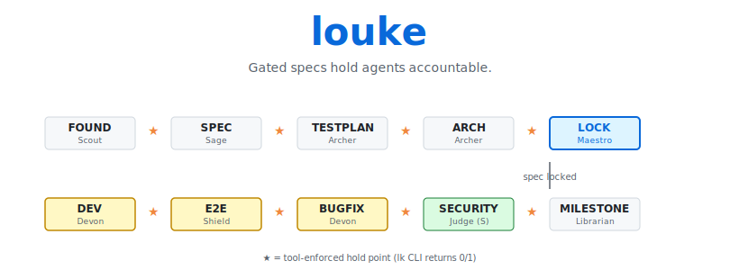

# louke

> **超越氛围写意，自是精密镂刻**



[🇺🇸 English](README.md) · [🇨🇳 中文](README.zh.md)

**louke 是一套规格先行、测试驱动、工具对齐 Agent 行为的多 Agent 协作开发方法。** 每个阶段转换是工具强制的检查。

---

### 为什么是 louke？

你不可能凭借一句话式的氛围编程就造出一个真正可用的软件。

一个真正可用的软件，它可能包含成百上千个子项需求，数以万计的执行路径和边界检查条件。

我们必须依赖具体、详尽的规范、验收标准和测试计划。人类必须参与、指导这些文档的生成，通过工具将它们拆解成为数以百（千）计的、可跟踪的子项目，让 Agent 的代码与这些子项目一一对应，才有可能构造成一个可回退、可追踪、可信的软件生产过程。

这就是镂刻的价值。超越氛围编程，把智能体编程变成精密制造，完美实现你规定的每一个细节。

当我们进行氛围编程时：

- 你并没有想清楚想要一个什么样的软件，却希望 Agent 知道
- 文字始终是写意的，包含了很大的想象空间，而软件必须是精确的
- 讲述了许多 Story，但无论是 AI，还是你自己，都没有形成一个完整的施工图

即使是 spec-kit / superpowers / oh-my-openagent，依然没人把 spec 做成"编程契约"。一份 spec 要成为契约，得同时满足三件事：

- **子需求之间是正交关系** —— 子需求之间不矛盾、不重复，已经过奥卡姆剃刀的修剪。
- **颗粒度合适** —— 你不可能要求 Agent 能读完上万字的文档，并且还能把握住其中每一个小小的细节。除非你把它们拆成一项项可以完美装进一个 PR 的任务里。
- **可追踪** —— 从需求到代码到测试，每一条线索都必须可以双向追溯：向前能查到源头，向后能查到落点。任何一条需求如果找不到对应的代码和测试，它就是挂在墙上的空头支票。

而 louke 跟其它框架之间，横亘着一条最深的鸿沟：louke 把所有这些做成了"基础设施即检查点"（Infrastructure-as-Checkpoint）——可追踪的闭环不在 AI 的自律里，而在外部 CLI 在 commit-time 的强制执行里。exit 0/1 是 OS 进程返回值，绕不过。工程世界只认这一种语言。

### louke 提供什么

louke 把上面的契约三原则落到 5 件可观测的事上。每件都有一条 lk 命令或可追溯的产物对应——不只是 prompt，而是工具：

- **spec → GitHub issue，commit 必带 issue 引用** —— Lex 把每个 FR 自动转成一个 issue，Devon 的 commit message 强制 `#NNN` 格式。需求到代码，单向追溯，永不丢失

- **test ↔ AC-FRXXXX-YY 自动关联，CI 静态校验双向闭合** —— 每个测试 docstring 必带 `AC-FRXXXX-YY` 编号。`lk archer ci-scan` 在 commit-time 校验：每条 AC 必被测试引用，每个测试必引用 AC。不闭合，merge 阻断

- **反模式 CI 门禁 + 身份一致性检查** —— `lk keeper gate` 静态扫 8 类反模式（`assert True` / `try/except: pass` / 无 issue skip / mock 框架核心 等）。`lk scout identity-check` 在流程启动前锁定 gh/git 身份一致性。违规即阻塞

- **项目 wiki 自动蒸馏** —— 基于 LLM compounding engineering 理念，`.louke/raw/`（每 Agent 的会话记录）→ `.louke/wiki/`（结构化知识）。事实、决定、现状一目了然且可 lint

- **苏格拉底式需求询问** —— Sage 多轮追问模糊的 story，直到磨出可追踪的 `spec.md` + `acceptance.md`

`louke` 定义了 12 个专业 Agent、10 阶段流水线、一个 `lk` CLI——让每次转换都是真正的检查，不是"agent 互相 review"那种软约束。每个 Agent 都有自己专属的工具箱，在每个 holdpoint 上，工作被卡点验证。

### 流水线

| 阶段        | 实施者        | 评审者               | 说明                                |
| ----------- | ------------- | -------------------- | ----------------------------------- |
| M-FOUND     | Scout         | Warden               | 项目奠基 + 权限门                   |
| M-SPEC      | Sage          | Lex                  | 规格 + acceptance.md                |
| M-TESTPLAN  | Archer        | Sage                 | 测试计划（Sage 有独有 spec 上下文） |
| M-ARCH      | Archer        | Prism                | 架构 + 接口                         |
| M-LOCK      | Maestro       | 用户                 | 3 信号锁定                          |
| M-DEV       | Devon         | **Prism → Keeper ★** | 代码 + 单元测试                     |
| M-E2E       | Shield        | **Prism → Keeper ★** | e2e 测试（B 级）                    |
| M-BUGFIX    | Devon         | **Keeper ★**         | Bug 修复                            |
| M-SECURITY  | Judge（S 级） | 用户                 | 深度安全审计                        |
| M-MILESTONE | Librarian     | Maestro              | raw → wiki 蒸馏                     |

★ **HOLD POINT**——工具强制检查（`lk` CLI 返回 0/1；不通过就不前进）。`★` 仅标 **commit-time 阻断 merge** 的核心 PROD 路径（`lk keeper gate` / `lk archer ci-scan` / `lk judge security-audit`）。其它阶段的 `lk sage quote-check` / `lk lex verify-acceptance` / `lk warden foundation-check` 也是 hold point，但发生在 stage transition 而非 commit-time。

**核心原则：实施者 ≠ 评审者。始终。**

### 命名由来

12 个 Agent 名字取自各自的本职语义，不是装饰：

| Agent | 含义 | 职责联想 |
|-------|------|---------|
| **Maestro** | 指挥家 | 协调整支乐队 |
| **Scout** | 勘探者 | 探路、确认前置条件 |
| **Warden** | 看守人 | 守门、确认退出条件 |
| **Sage** | 贤者 | 苏格拉底式追问 |
| **Lex** | 律法 | 审核法律级精确性 + 组织 issue |
| **Archer** | 射手/架构师 | 设计执行路径（test-plan + architecture） |
| **Devon** | 锻造者 | 从测试的烈火中锻造代码（R-G-R） |
| **Prism** | 棱镜 | 多角度审视代码质量（含测试 + 安全 quick scan） |
| **Judge** | 裁判 | S 级深度安全审计 |
| **Shield** | 盾牌 | 写端到端测试脚本（B 级） |
| **Keeper** | 守护者 | 守住质量门禁（gate + 回归判断） |
| **Librarian** | 图书管理员 | 整合 Wiki，维护项目记忆 |

### 安装

```bash
# 标准 pip-based 安装（推荐）：自动建 venv、配 PATH、链接 lk 到 ~/.local/bin
curl -sSL https://raw.githubusercontent.com/zillionare/louke/main/install.sh | bash

# 或指定版本
curl -sSL https://raw.githubusercontent.com/zillionare/louke/main/install.sh | bash -s -- v0.3.0

# 开发模式（clone 后 editable 安装）
git clone https://github.com/zillionare/louke
cd louke
./install.sh --editable

# 验证
lk --help
```

`install.sh` 会做 4 件事：

1. 在 `~/.louke/venv/` 建独立 venv（不污染系统 Python）
2. `pip install louke` 装到 venv
3. `~/.local/bin/lk` → venv 内 `lk` 的符号链接，并 append PATH 到 shell rc
4. 验证 + 打印卸载指引

卸载：

```bash
rm -rf ~/.louke/venv ~/.local/bin/lk
```

你会得到：
- `lk` CLI（12 个 agent × 32 命令）
- `templates/` — 4 个文档模板（spec, acceptance, test-plan, security-checklist）
- `louke/_tools/` — Python 脚本，被 `lk` 包装

### 在项目中使用

把框架复制到你的项目：

```bash
cd your-project
cp -r /path/to/louke/agents ./
cp -r /path/to/louke/templates ./
```

或通过 CLI 初始化：

```bash
lk scout foundation --repo YOUR_ORG/YOUR_REPO --version v0.1 --spec-id v0.1-001-init
# → 创建 .louke/project/project-info.md
# → 创建 .louke/project/specs/v0.1-001-init/story.md
# → 打开编辑器让你填写 story（交互式）
```

`lk scout foundation` 引导你完成：
1. Step 1 — 收集 story/版本号/repo 名/DoD（交互式）
2. Step 2 — 创建 repo + project + 权限
3. Step 3 — 验证 gh + git 账号一致
4. Step 4 — 跑 `lk warden foundation-check`（F1-F11 自动检查）
5. Step 5 — 提交 + push

### 与你的 AI 助手配合

`agents/*.md` 是自然语言 agent prompt。任何能读指令的 coding agent 都能用。

#### OpenCode

在 `~/.config/opencode/opencode.json` 加 plugin：

```json
{"plugin": ["louke"]}
```

#### Claude Code

把 `agents/` 放到 `.claude/agents/`，通过 `--agent` 引用：

```bash
claude --agent agents/Sage.md "跟我聊用户认证"
```

#### VSCode（Cursor / Continue / Copilot）

把 agent prompt 加到 rules：

```json
// .continue/config.json
{
  "rules": [
    "agents/Maestro.md",
    "agents/Sage.md",
    "agents/Archer.md"
  ]
}
```

Cursor：**Settings → Rules → Add file → `agents/Sage.md`**

### 一个工作流

用上面任一 AI 助手，典型会话：

```
1. lk scout foundation            # 初始化项目，验证权限
2. "你是 Sage，跟我聊用户认证"    # AI 扮演 Sage
3. lk sage commit-spec --spec ...  # 提交 spec + acceptance
4. lk lex verify-acceptance       # [HOLD POINT] 不同 agent，工具强制
5. "你是 Archer，写 test-plan + arch + interfaces"
6. lk archer ci-scan              # AC 引用 + 反模式 扫描
7. "你是 Devon，用 R-G-R 实现"
8. lk devon commit-rgr --phase red/green/refactor
9. lk keeper gate                 # [HOLD POINT] commit 格式
10. lk judge security-audit       # [HOLD POINT] S 级安全审计
11. lk librarian from-raw         # 会话 → wiki
12. lk maestro status             # 进度
```

每个 `★` HOLD POINT 返回 0（通过）或 1（失败）。不通过就不前进。

### 一个 Spec 的端到端

假设要建用户认证：

1. **M-FOUND**（Scout）— `lk scout foundation` 创建 repo、GitHub Project、Test Issue 验证权限
2. **M-SPEC**（Sage → Lex）— Sage 苏格拉底式追问（MFA？session 超时？rate limiting？）。Lex 找到 3 个问题。Sage 修复后，**3 信号齐**时锁定 spec：`lk sage quote-check` exit 0 + Lex 3 阶段通过 + 用户 IDE 确认
3. **M-TESTPLAN**（Archer → Sage）— Archer 写 test-plan + 3 层测试策略 + AC 追溯 + 反模式规则。Sage 评审（有 M-SPEC 的独有上下文）
4. **M-ARCH**（Archer → Prism）— Archer 写 architecture.md + interfaces.md。Prism 查 spec/code 一致性
5. **M-LOCK**— Spec 锁定。开始实现
6. **M-DEV**（Devon → Prism → Keeper）— Devon 用 R-G-R 实现。每次 commit 前缀 `test: red` / `feat: green` / `refactor`。Prism 评审（批判 + 测试反模式 + 安全 quick scan）。Keeper 跑 `lk keeper gate`（commit 格式 + tests）
7. **M-E2E**（Shield → Prism → Keeper）— Shield 写 e2e（B 级，固定方法：Playwright/testclient/DB）。同 Prism + Keeper
8. **M-SECURITY**（Judge S 级 → 用户）— `lk judge security-audit` 做 pattern 扫描 + S 级语义审查。用户最终拍板
9. **M-MILESTONE**（Librarian → Maestro）— `lk librarian from-raw` 把会话蒸馏到 wiki。`lk maestro advance --stage M-MILESTONE` 关闭 milestone

每次转换是不同 Agent。每次 hold point 工具强制。每次 handoff 显式。

### louke vs 其它（从对比视角看 louke 是什么）

> 哲学段（上行）说 louke 跟 spec-kit / superpowers / oh-my-openagent 一样在解决"靠 AI 写代码"，但 louke 把其中四件事做成"工程合同"而不是"AI 自律"。这张表把差距摊在明面上。

| 框架 | spec 是不是契约？ | review 由谁做 | 强制层 | spec → code → test 闭环 |
|---|---|---|---|---|
| **spec-kit**（GitHub） | spec.md 是源头，但无 MECE / 粒度 / 可追踪约束 | 无 review | 无 | 手工 + 社交 |
| **superpowers**（obra，240k★） | plan.md 是文本，无 AC 编号，无 commit-time 校验 | subagent review（同 model 自检） | prompt 级自律 | TDD 间接保证（test ↔ spec 无 ID 绑定） |
| **oh-my-openagent**（code-yeongyu，64k★） | agent 自消化 spec | team of agents（同 LLM 不同 prompt） | hooks / middleware | task 自定，无 FR ↔ test 绑定 |
| **louke** | FR-XXX / AC-XXX-N + `lk archer ci-scan` | 12 个不同 persona（实施者 ≠ 评审者，跨阶段语境不重叠） | `lk` CLI exit 0/1（OS 进程返回值） | FR ↔ issue ↔ commit ↔ AC ↔ test 全链路 |

独特主张（再压缩一次）：**spec 通过基础设施变成合同，agent 通过 hold point 担责，不是"AI 自己写好"。**

### 架构（简）

```
  agents/*.md              templates/*.md                louke/                louke/_tools/*.py
  (12 prompts)            (spec, acceptance,           (32 commands,         (Python scripts,
                         test-plan, security-          12 agents)           wrapped by lk)
                         checklist)
       │                       │                            │                      │
       └───────────┬───────────┴────────────┬───────────────┘                      │
                   │                        │                                      │
                   ↓                        ↓                                      ↓
            AI 助手                    工具强制                              被 lk 包装
         (OpenCode, Cursor,           hold points
          Claude Code,                 (lk keeper gate,
          Continue 等)                   lk judge
                                      security-audit)

  两层记忆:
    .louke/raw/    →   事件级, per-agent 会话记录
    .louke/wiki/   →   蒸馏后的知识, 由 Librarian 维护
```

- **12 Agent** = 实施者与评审者是不同 persona，跨阶段语境不重叠
- **`lk` CLI** = OS 进程级合同，`exit 0/1` 不可绕过
- **两层记忆** = `raw/`（事件级）+ `wiki/`（蒸馏级），由 Librarian 维护
- **承诺** = spec → code → test 三段双向可达，任一节点断裂都查得到源头

### 许可证

MIT
