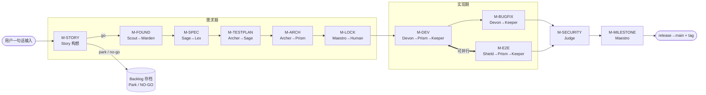
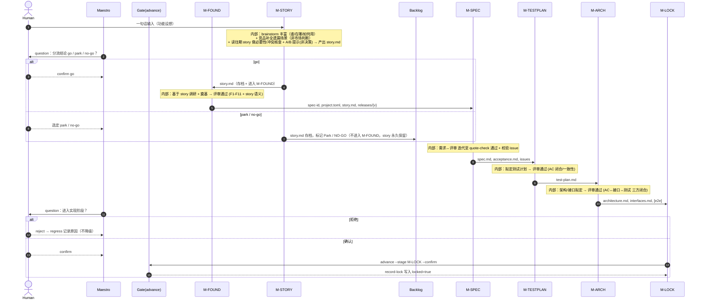
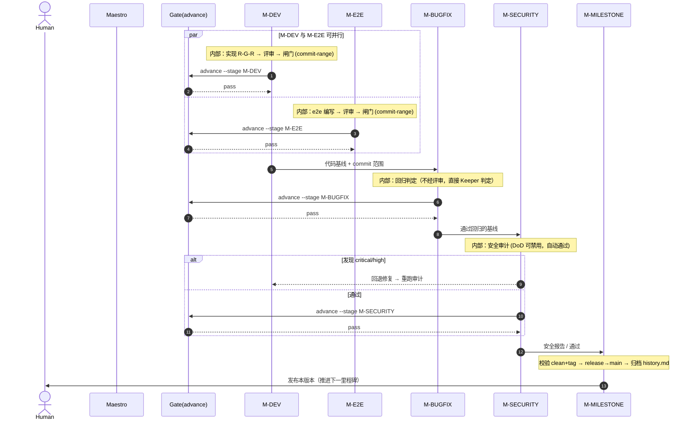

# Louke 开发工作流（Maestro 编排）

> 来源：`louke/agents/Maestro.md`
> 当前版本：基线 + M-STORY（需求构想，流水线入口）
> 编排者：Maestro（主 Agent），通过 `lk agent maestro advance` 工具强制 holdpoint 闸门

---

## 1. 一眼概览

Louke 是一个面向**多 Agent 协作软件开发**的工作流。核心特征：

1. 每个 Spec 由 Acceptance 明确定义
2. 每个 Spec 可追踪（唯一 ID，关联 Acceptance / GitHub Issue / commit）
3. 用 GitHub Project 收集想法、管理 release
4. **Agent 即工作流**——`lk` 工具保证步骤不遗漏
5. 开发过程使用 RGR（Red-Green-Refactor）机制，工具强制执行合规
6. LLM-wiki 蒸馏项目记忆，随时可查技术决策
7. 结对编程——多数 Agent 有自己的 gatekeeper
8. 过程处处留痕，人类可随时接管
9. 及时提交，随时可回滚
10. 适用完整功能开发、紧急 bug fix、需求变更

---

## 2. 阶段 ↔ Agent 映射

| Stage code    | Stage             | Implementer                 | Reviewer                          | 一句话任务                                              |
| ------------- | ----------------- | --------------------------- | --------------------------------- | ------------------------------------------------------- |
| `M-FULL`      | 全流水线          | **Maestro**（指挥）          | —                                 | 协调 Agent、推进工作流、处理异常与升级决策              |
| `M-STORY`     | 需求构想          | **Story**                  | Human（确认 story 完整可用）      | 一句话→丰富 story：谁/在哪/如何用 + 竞品补全 + 必要性/冲突核查 + A/B 提示，产出 story.md |
| `M-FOUND`     | 项目奠基          | **Scout**                   | **Warden**                        | 基于 story 调研前提 / Warden 闸门退出条件               |
| `M-SPEC`      | 需求定义          | **Sage**                    | **Lex**                           | Socratic 问答产出 spec / Lex 评审 + 程序化校验          |
| `M-TESTPLAN`  | 测试计划          | **Archer**                  | **Sage**                          | Archer 定测试计划 / Sage 评审                           |
| `M-ARCH`      | 架构设计          | **Archer**                  | **Prism**                         | Archer 定架构与接口 / Prism 内容评审                    |
| `M-LOCK`      | 需求锁定          | **Maestro**                 | Human                             | **决定是否进入实现阶段**                                |
| `M-DEV`       | 开发执行          | **Devon**                   | **Prism** → **Keeper**            | Devon R-G-R / Prism 多角度评审 / Keeper 闸门           |
| `M-E2E`       | e2e 开发          | **Shield**                  | **Prism** → **Keeper**            | Shield 按 test-plan §6 写 e2e / Prism 评审 / Keeper 闸门 |
| `M-BUGFIX`    | Bug 修复          | **Devon**                   | **Keeper**                        | Devon 复用 R-G-R / Keeper 回归判定                      |
| `M-SECURITY`  | 安全审计          | **Judge**                   | Human                             | 深度安全审计（按里程碑；DoD 可禁用）                    |
| `M-MILESTONE` | 里程碑结束        | **Maestro**                 | Human                             | Maestro 发布本版本并推进下一里程碑                      |

**补充规则**

- `M-SECURITY`：DoD 可禁用（自动通过）。按里程碑执行，在 M-MILESTONE 之前。高风险路径可触发额外按 PR 运行。
- `M-LOCK`：**不可跳过**。Maestro 必须在此显式询问人类，收到肯定答复后才可推进。
- `Librarian`：轻量 Agent，每日将项目知识蒸馏进 wiki。
- **并发约束**：仅 `M-DEV` + `M-E2E` 可并行；其余阶段严格串行。

---

## 3. 阶段流转图（Stage flow）



---

## 4. 阶段时序图（Stage-based sequence）

> 以 **阶段（Stage）** 为生命线，而非 Agent。阶段之间的消息表示**产物交接**；
> 阶段内部的「实现者 ↔ 评审者」迭代收敛为 agent-agnostic 的 `内部` 注释——
> 因此即便后续取消/替换某些 Agent，本图与阶段本身都不受影响。
> `Gate` 即 `lk agent maestro advance` 的 holdpoint 校验，确保退出条件满足才放行。

### 4.1 需求期（M-FOUND → M-LOCK）



### 4.2 实现期（M-DEV → M-MILESTONE）



### 4.3 跨阶段回退环（Rework loops）

阶段内部评审失败 → 回到本阶段实现者修订（agent-agnostic）。
涉及上游或安全问题的跨阶段回退：

```mermaid
sequenceDiagram
    autonumber
    participant D as M-DEV
    participant E as M-E2E
    participant B as M-BUGFIX
    participant J as M-SECURITY

    J-->>D: critical/high 否决 → 修复后重跑 M-SECURITY
    B-->>D: 回归失败 → 修复后重跑 M-BUGFIX
    E-->>D: e2e 评审否决 → 修复后重跑 M-E2E
    Note over D,E,B,J: 所有回退均在「阶段」层面表达，<br/>与具体实现 Agent 解耦
```

---

## 5. 各阶段派发序列（Per-stage dispatch）

> 两条通道：**spawn**（用 `task` 让 Agent 工作）与 **gate**（`advance` 检查退出条件）。
> 每个 `task` 必须传递：spec-id、当前步骤、前序产出摘要、文件路径（`.louke/project/specs/{spec-id}/`）。
> 拒绝处理：Agent 返回 `[REJECT]` → 提取 ≤3 个 blocker 回传 implementer 重 spawn；同一轮卡 ≥3 次 → `escalate`。

### M-STORY（需求构想 / Story）
```
输入：用户一句话功能设想
活动：
  1. brainstorm：丰富为可用 story，明确
       - 谁（身份、人数、主次 persona 排序）
       - 在哪里（何种终端 / 设备）
       - 如何使用该功能
  2. 竞品 / 市调（只为“补全故事”，不做“市场判断”）：
       调查同类产品在“该需求场景下”如何处理，
       把用户没想到的角色 / 流程 / 异常 / 终端适配补进 story；
       输出 adopt / avoid 清单，语义是“补全素材”而非“市场裁决”
       （Agent 不得得出“市场饱和 / 此路不通”之类的市场结论）
  3. 为什么做（north star）：
       - 问题陈述 + 价值 / 目标（解决什么痛点、成功长什么样）
       - 成功指标（可观测、可衡量的结果，供后续 acceptance 量化）
  4. 边界与约束：
       - 非目标 / out-of-scope（显式划界，防范围蠕变）
       - 约束（性能 / 合规 / 平台 / 与现有系统集成限制）
  5. 必要性与冲突核查（读往期 story）★：
       - 读取 .louke/project/stories/*/story.md、wiki、backlog、已 accepted 规格
       - 已实现？→ 建议复用 / 合并
       - 相抵触？→ 标出与哪条 STR-xxxx / spec 冲突
       - 超出现有可见范围时标 [需人工确认]，不臆断
  6. 方案疑议提示（A/B Advisory，非决策）★：
       - 用户要 A、证据显示 B 更贴合其陈述目标时，给出 💡 替代建议 + 证据
       - 仅 advisory，最终由 Human 裁决；Agent 不做市场 / 产品终局判断，也不自动替换方案
  7. 风险与假设：
       - 假设（brainstorm 时默认成立、待验证的点）
       - 风险（可能让功能翻车的点，早期暴露「想当然」）
  8. 可行性分流（go / no-go / park）：
       - go    → 继续 M-FOUND
       - park  → story.md 存档入 Backlog，标记 Park（不进入 spec）
       - no-go → story.md 存档入 Backlog，标记 NO-GO（不删除，供未来参考/复用）
       - 无论结论，story.md 均永久存档（story-id 保留）
  9. 可追溯种子（契合 Louke 原则 #2）：
       - 生成 story-id，登记到 GitHub Project 想法 / backlog，
         与未来 spec-id / Issue / commit 串联
 10. 产出 story.md（见下方字段 schema）
Gate: advance --stage M-STORY
  需：story.md 存在且含「用户 / 终端 / 使用方式 / 竞品」四要素
     + necessity / conflict 已填（或标 [需人工确认]）
     + 分流结论 ∈ {go, park, no-go} 且经 Human 确认（不可跳过）
  说明：Agent 对 4W + EARS 完整性**自检**，满足则不向用户追问；
        Human 只在决策点介入——确认分流结论，及裁决 Agent 提出的冲突 / A-B 建议。
  分支：
     - go    → 继续 M-FOUND
     - park  → story.md 存档入 Backlog，标记 Park，本 run 终止
     - no-go → story.md 存档入 Backlog，标记 NO-GO，本 run 终止（不删除，供未来参考/复用）
注：本阶段为流水线入口，先于 M-FOUND；由 Story Agent 主持（semantic_task，
    不写 run 状态、不调用 advance）。
```

#### story.md 字段 schema
```
story-id          : STR-xxxx                      # 可追溯种子，关联 GitHub Project 想法
one-liner         : <用户原话的一句话设想>
personas          :                                # 用户画像
  - role         : <身份>
    count        : <人数>
    priority     : primary | secondary            # 主次 persona 排序
terminal          : <终端 / 设备类型>
usage            : <如何使用该功能（步骤级）>
problem_goal     :                                # 为什么做
  problem       : <痛点>
  goal          : <目标 / 成功长什么样>
success_metrics  : <可观测、可衡量的结果>
non_goals        : <非目标 / out-of-scope>
constraints      : <性能 / 合规 / 平台 / 集成限制>
competitors      :                                # 竞品结构化（补全素材，非市场裁决）
  adopt         : <我们故事遗漏、可借鉴的场景 / 角色 / 边界>
  avoid         : <应提前规避的坑>
necessity        :                                # 必要性与冲突核查（读往期 story）
  already_exists: <否 | 是——可复用 STR-xxxx / spec>（证据）
  conflicts_with: <否 | 是——与 STR-xxxx / spec 冲突：...>
  verdict       : new | merge | fork | needs-human-confirm
alt_suggestion   :                                # A/B Advisory（非决策）
  status        : none | suggested
  suggestion    : <💡 你可能更想要 B，因为 ...>（仅提示，不替换）
assumptions      : <待验证的假设>
risks            : <潜在风险>
triage           : go | no-go | park              # 可行性分流结论
```


### M-FOUND（Scout → Warden）
```
1. spawn Scout   steps 1-6（基于上游 story.md 调研 + 奠基）
                 产出：spec-id, project.toml, releases/{version}
                 （story.md 由 M-STORY 上游产出，此处消费 / 承接）
2. spawn Warden  foundation-check (F1-F11) + story.md 语义检查
3. Warden [REJECT] → blockers 回传 Scout 修复 → 重跑 Warden
   Warden [PASS] → advance
Gate: advance --stage M-FOUND  (project.toml 存在)
```

### M-SPEC（Sage ↔ Lex 迭代 + 锁定 + Issue + 校验）
```
1. spawn Sage    steps 1+2：问答 + 生成 spec.md / acceptance.md
2. 迭代 N 轮：
   a. spawn Lex   Stage 1：verify-acceptance + 追加 quotes 到 spec.md
   b. spawn Sage  Step 3：回应 quotes，更新 spec
   loop 条件：lk agent sage quote-check --spec {spec-id}
             exit 0 → 退出 / exit 1 → 继续（1-5+ 轮）
3. spawn Sage    Step 4：lk agent sage record-lock (needs user --confirm)
4. spawn Sage    Step 5：lk agent sage create-issues
5. spawn Lex     Stage 2+3：verify-issue + verify-project (L1-L8)
Gate: advance --stage M-SPEC（lk agent sage quote-check exit 0）
双信号：1) Sage quote-check exit 0  2) Lex verify-acceptance + verify-issue 全过
```

### M-LOCK（Maestro → 人类确认）
```
不 spawn 子 Agent。Maestro 用 question 询问用户是否进入实现阶段。
1. 确认三个信号齐全
2. question → 用户确认 / 拒绝（拒绝 → regress 记录原因，不降级）
Gate: advance --stage M-LOCK --confirm（--confirm 必填 + record-lock 写入 locked:true）
纪律：不可跳过。此后新需求/变更只能作为新 spec 进入 backlog。
```

### M-TESTPLAN（Archer → Sage）
```
1. spawn Archer  Phase 1：test-plan.md + [meta].test_framework
2. spawn Sage    review：AC 闭合 / 状态字段 / concern 继承 / spec 一致性
                产出：.louke/project/stage-results/{SPEC-ID}/M-TESTPLAN/review-result.json
3. Sage [REJECT] → quotes 摘要回传 Archer 修订 → 重跑 Sage
Gate: advance --stage M-TESTPLAN
  需两者：archer validate-test-plan exit 0 + author-result.json
        且 Sage review-result.json verdict=pass（当前 contract bundle hash, source_command=review）
```

### M-ARCH（Archer → Prism）
```
1. spawn Archer  Phase 2：architecture.md + interfaces.md + [e2e] 段
                key：AC → interfaces → test-plan 三方闭合
                key：决定 host-project e2e 路径 + 跑 contract（非通用脚手架）
2. spawn Prism   M-ARCH review（纯语义，6 项一致性，不用 lk 工具）
                产出：.louke/project/stage-results/{SPEC-ID}/M-ARCH/review-result.json
3. Prism [REJECT] → blockers 回传 Archer 修订 → 重跑 Prism
Gate: advance --stage M-ARCH
  需两者：archer validate-arch exit 0 + author-result.json
        且 Prism review-result.json verdict=pass（当前 hash, source_command=review）
```

### M-DEV（Devon → Prism → Keeper）
```
1. spawn Devon   R-G-R（按 issue，顺序）
2. spawn Prism   M-DEV：lk agent prism review（test-patterns + security-quick-scan）
                产出：.louke/project/stage-results/{SPEC-ID}/M-DEV/review-result.json
   [REJECT] → Devon 修复 → 重跑 Prism
3. spawn Keeper  lk agent keeper gate --commit-range {range} --stage M-DEV
                产出：.louke/project/stage-results/{SPEC-ID}/M-DEV/gate-result.json
   exit 1 → Devon 修复 → 重跑 Prism → Keeper
   exit 0 → advance
Gate: advance --stage M-DEV --commit-range HEAD~1..HEAD
  需两者：Prism review-result.json verdict=pass, commit_range 匹配, source_command=review
        且 Keeper gate-result.json verdict=pass, commit_range 匹配
```

### M-E2E（Shield → Prism → Keeper）
```
1. spawn Shield  host-project e2e（per test-plan §6）+ commit-e2e
                Shield 写入 Archer 决定的 host-project test 目录，绝不写 .louke/
2. spawn Prism   M-E2E：lk agent prism review --stage M-E2E --spec-id {SPEC-ID} --commit-range {range}
                产出：.louke/project/stage-results/{SPEC-ID}/M-E2E/review-result.json
   [REJECT] → Shield 修复 → 重跑 Prism
3. spawn Keeper  lk agent keeper gate --commit-range {range}
   exit 1 → Shield 修复 → 重跑 Prism → Keeper
   exit 0 → advance
Gate: advance --stage M-E2E --commit-range HEAD~1..HEAD
  需：Prism review-result.json verdict=pass, commit_range 匹配, source_command=review
      Shield author-result.json verdict=pass
      Keeper gate-result.json verdict=pass, commit_range 匹配
```

### M-BUGFIX（Devon → Keeper）
```
1. spawn Devon   修复 bug（复用 R-G-R）
                branch：fix/{issue-number} → 合并 main + release
2. spawn Keeper  lk agent keeper regression --baseline main --current HEAD
   exit 1 → Devon 修复 → 重跑 Keeper
   exit 0 → advance
Gate: advance --stage M-BUGFIX（lk agent keeper regression exit 0）
注意：不经 Prism，直接 Devon → Keeper 回归。
```

### M-SECURITY（Judge）
```
1. DoD 禁用安全审计 → 自动通过
2. spawn Judge   lk agent judge security-audit --release releases/{version} --baseline main
                critical/high = [REJECT] → Devon 修复 → 重跑 Judge
                pass → advance
Gate: advance --stage M-SECURITY --release {version}（judge exit 0 或禁用自动通过）
```

### M-MILESTONE（Maestro 自完成）
```
1. 校验 working tree clean + tag 存在
2. release → main，打 tag
3. 归档 project.toml → history.md
Gate: advance --stage M-MILESTONE（working tree clean + tag 存在）
```

---

## 6. 原则与纪律

1. 进入实现（M-TESTPLAN）前，必须完成 M-LOCK 并取得显式人类确认。
2. 需求锁定后，所有变更被拒；只能作为新 spec 进 backlog。
3. 一次只实现一个需求。
4. **严格顺序**：进入下一阶段前必须满足退出条件。
5. **回退机制**：评审失败回 implementer；涉及上游问题回上游。
6. **异常处理**：权限/信息不足必须升级人类——禁止静默失败。
7. **上下文传递**：每次 spawn 必须传递 §派发协议规定的上下文。
8. **并发约束**：仅 M-DEV + M-E2E 可并行。

## 7. 分支管理

- **单一活动分支**：任意时刻仅一个 release 分支；功能不并行；必要时用 worktree。
- **可保留多分支**：历史 release / hotfix 分支可留在 GitHub，由人类决定是否删除。

```
main
  |-- releases/v0.1   ← 历史（已合 main）
  |-- releases/v0.2   ← 历史（已合 main）
  |-- releases/v0.3   ← 当前活动
```

- **Bug 修复**：`fix/{issue-number}` → 合 main + 当前 release（防漂移）；保留与否由人类决定。

## 8. 反模式

- ❌ 评审未过时推进到下一阶段
- ❌ 亲手做本该由专职 Agent 做的工作
- ❌ 丢失前序产出的追踪 ID
- ❌ 静默忽略 Agent 错误而不升级
